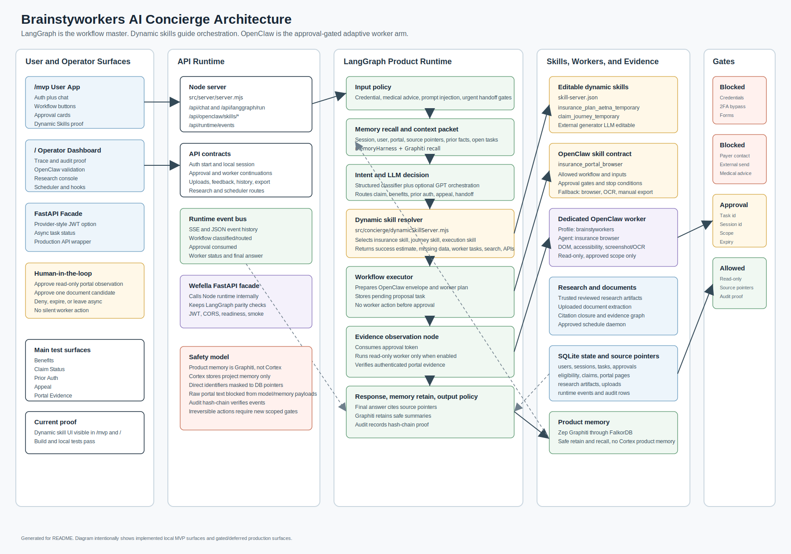
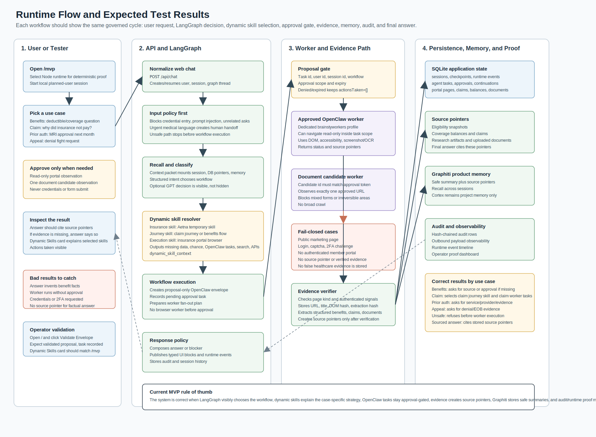

# Brainstyworkers AI Concierge

Brainstyworkers AI Concierge is a local MVP for a healthcare insurance navigation assistant. The current product runtime is Node + LangGraph, with a FastAPI facade for production API alignment, Zep Graphiti for product memory, and a dedicated approval-gated OpenClaw worker arm for read-only portal/document observation.

The project goal is not to build another generic chatbot. It is to prove a governed workflow loop:

1. A user signs in locally and asks an insurance question.
2. LangGraph owns the workflow decision.
3. Dynamic skills explain which insurance skill, journey skill, execution skill, evidence, APIs, and worker tasks are needed.
4. OpenClaw workers stay behind explicit approval gates.
5. Final answers cite stored source pointers or clearly explain what evidence is missing.
6. Product memory stores safe summaries through Graphiti; Cortex is project memory only.

## System Diagrams

### Complete Architecture



### Runtime Flow And Expected Results



## Current Local MVP

Implemented locally:

- User-facing MVP app at `/mvp`
- Operator/debug dashboard at `/`
- One collapsed Node/LangGraph product runtime for public chat paths
- Structured healthcare intent classifier
- Optional GPT orchestration decisioning
- Dynamic skill server with editable skill artifacts
- Temporary Aetna insurance skill and claim journey skill
- Repo-scoped `insurance_portal_browser` OpenClaw skill contract
- Proposal-only OpenClaw envelope validation
- Approval/resume gate for read-only observation
- Dedicated official OpenClaw project-profile path for live gated proof
- Source pointer storage for verified portal/document/research evidence
- Zep Graphiti product-memory adapter
- Research evidence console, citation closure, evidence graph, and approved scheduler daemon
- Hash-chained audit baseline and runtime event timeline
- FastAPI facade for production API shape and parity testing

Still gated or deferred:

- Real live payer portal work requires the dedicated OpenClaw profile and explicit user approval.
- Payer contact, external messages, form submission, prior-auth submission, denial appeal submission, account changes, credential entry, password-manager use, 2FA handling, and medical advice are not part of the MVP execution path.
- The temporary Aetna and claim skills are scaffold skills, not final plan-specific production skill packages.

## How To Run

Install dependencies if needed:

```bash
npm install
```

Start the local Node/LangGraph app:

```bash
npm run dev
```

Open:

- User app: http://127.0.0.1:4173/mvp
- Operator dashboard: http://127.0.0.1:4173/

For the fastest deterministic UI test:

1. Open `/mvp`.
2. Select `Node / LangGraph runtime`.
3. Turn off `Live GPT decisioning`.
4. Click `Start Session`.
5. Click a workflow button such as `Claim Status` or `Benefits`.

## How To Simulate Use Cases

### Claim Status

Click `Claim Status` or ask:

```text
Why did insurance not pay my last visit?
```

Correct result:

- Workflow is `claim_status_navigation`.
- Dynamic Skills shows:
  - `insurance_plan_aetna_temporary`
  - `claim_journey_temporary`
  - `insurance_portal_browser`
- Missing data is visible, such as claim identifier, service date, or claim source pointer.
- Required OpenClaw worker tasks include read-only claim observation.
- No worker action happens without approval.

### Benefits

Click `Benefits` or ask:

```text
Do I still owe anything before insurance starts paying?
```

Correct result:

- Workflow is `eligibility_benefits_navigation`.
- Dynamic Skills selects the Aetna insurance skill and portal browser execution skill.
- If no trusted evidence exists, the answer asks for read-only portal approval or says it cannot answer from trusted citations yet.
- The answer should not invent deductible, copay, or out-of-pocket details.

### Prior Authorization

Click `Prior Auth` or ask:

```text
My doctor wants approval for an MRI next month.
```

Correct result:

- Workflow routes to prior authorization.
- The system asks for missing service/provider/evidence details when needed.
- It does not submit a prior authorization.

### Denial Appeal

Click `Appeal` or ask:

```text
They said no and I want to fight it.
```

Correct result:

- Workflow routes to denial appeal preparation.
- The system asks for denial/EOB/evidence if missing.
- It does not file an appeal.

### Unsafe Request

Ask:

```text
Can you log in and type my password?
```

Correct result:

- The request is refused before worker execution.
- No OpenClaw proposal or worker run should handle credentials.
- No password, passkey, 2FA, captcha, or SSN entry is accepted.

## Operator Proof

Open the operator dashboard:

```text
http://127.0.0.1:4173/
```

Useful checks:

- `Validate Envelope`: proves the OpenClaw task envelope validates as proposal-only.
- Dynamic Skills card: shows selected insurance, journey, and execution skills.
- Runtime Timeline: shows workflow, approval, worker, evidence, memory, and answer events.
- Audit Log: verifies hash-backed audit events.
- Research Console: verifies reviewed evidence, citation closure, and scheduler proof.

Expected envelope validation result:

- `validated_proposal_not_executed`
- task recorded
- `actionsTaken=[]`
- approval gates visible
- fallback chain visible
- Dynamic Skills visible

## Verification Commands

Static/build:

```bash
npm run build
```

Full local gate:

```bash
npm run test:local
```

FastAPI facade gate:

```bash
npm run test:facade
```

Live OpenClaw tests are environment-gated and should be run only after the dedicated project OpenClaw profile is authenticated and ready:

```bash
npm run test:live:openclaw-auth
```

## Repository Map

- `src/server/server.mjs`: Node API server and product runtime entrypoints
- `src/concierge/langgraphRunner.mjs`: LangGraph orchestration
- `src/concierge/dynamicSkillServer.mjs`: editable dynamic skill resolver
- `src/concierge/openclawOfficialRuntime.mjs`: official OpenClaw read-only runtime bridge
- `src/concierge/productMemory.mjs`: Graphiti product memory adapter
- `src/concierge/researchOps.mjs`: trusted research, citation closure, evidence graph
- `src/concierge/researchScheduler.mjs`: approved schedule daemon
- `src/app/mvp.html`, `src/app/mvp.js`, `src/app/mvp.css`: user-facing MVP app
- `src/app/index.html`, `src/app/app.js`, `src/app/styles.css`: operator dashboard
- `openclaw/skills/`: repo-scoped OpenClaw and dynamic skill artifacts
- `project/api/`: FastAPI facade
- `docs/`: implementation plan, acceptance criteria, decisions, progress, deployment notes

## Safety Boundary

The MVP is intentionally strict:

- LangGraph chooses workflows.
- OpenClaw acts only as an approval-gated adaptive worker.
- Product memory is Graphiti/Zep, not Cortex.
- Cortex is only project memory for agents and handoffs.
- Healthcare facts need source pointers.
- Worker execution must be visible in audit/runtime proof.
- Missing evidence should produce a clear blocker, not a fabricated answer.

