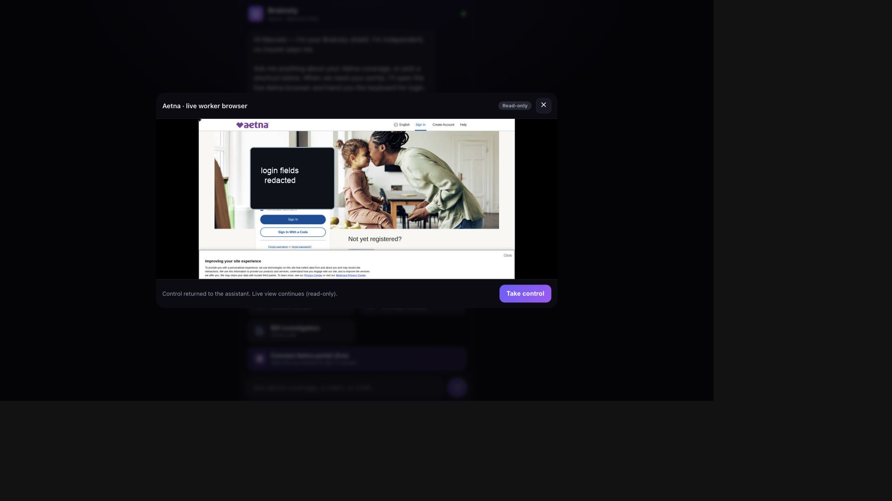
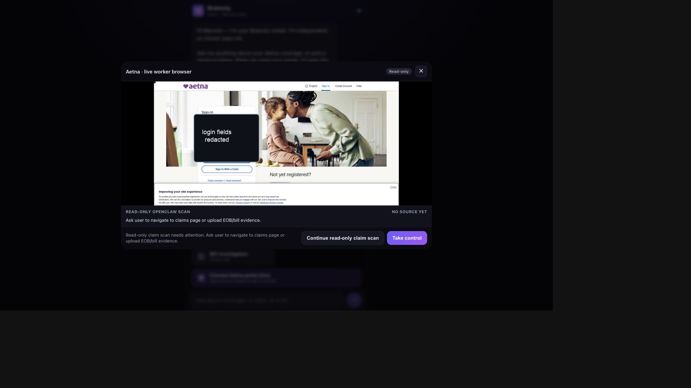
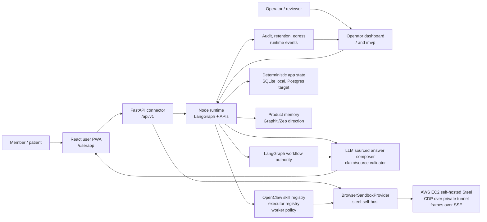
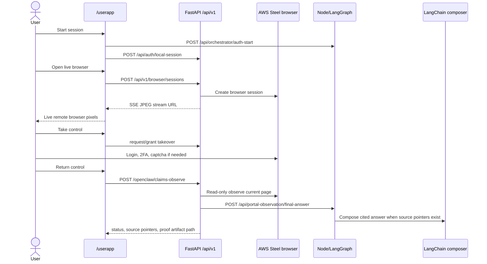
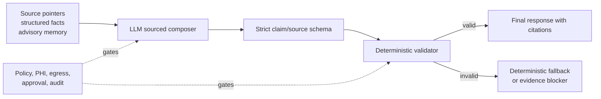
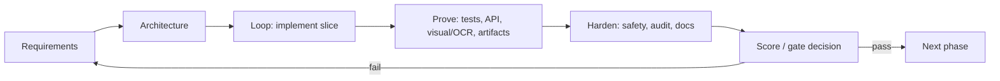

# Brainstyworkers AI Concierge

Brainstyworkers AI Concierge is a governed healthcare and insurance navigation system. It combines a regular-user PWA, a FastAPI connector, a Node/LangGraph product runtime, an approval-gated OpenClaw worker arm, and a self-hosted Steel browser sandbox on AWS.

The project is not a generic chatbot. It is a proof-driven healthcare workflow engine:

1. A member asks a coverage, bill, claim, provider, pharmacy, or procedure question.
2. LangGraph owns healthcare workflow authority and safety routing.
3. LLM reasoning helps classify intent, propose bounded work, and compose cited answers.
4. Deterministic rails enforce PHI, source, approval, egress, audit, and browser safety.
5. OpenClaw performs only bounded, approval-gated, read-only worker tasks.
6. Final answers cite source pointers or explain exactly what evidence is missing.
7. Product memory is server-side Graphiti/Zep-style memory; Cortex is project memory only.

## Current Status

The local/pilot MVP is implemented and verified for pre-login flows, remote-browser handoff, default facade configuration, and sanitized proof artifacts.

| Area | State |
| --- | --- |
| Regular-user app | Implemented as React/Vite PWA at `/userapp` |
| Operator dashboard | Implemented at `/` and legacy/parity `/mvp` |
| Public connector | FastAPI `/api/v1/*` at `:8000` |
| Internal runtime | Node/LangGraph/OpenClaw at `:4173` by default, often run as `:4226` for proof |
| Remote browser | Self-hosted Steel on AWS via private tunnel and default FastAPI facade |
| Human takeover | Implemented; user handles credentials, 2FA, captcha, and login screens |
| Claims observation | Pre-login fail-closed; signed-in proof still requires manual login and return-control |
| Proof artifacts | Sanitized `brainstyworkers.claims-observe-proof.v1` artifacts |
| Production blockers | Signed-in Aetna proof, production Postgres rollout, production memory, hosted browser ops hardening |

## Screenshots

The screenshots below are README-safe copies with login fields redacted.

| Remote worker browser | Read-only scan gate |
| --- | --- |
|  |  |

Older architecture diagrams remain available:


## Architecture



## Main User Flow



## Sourced Answer Pipeline



## RALPH Loop

The project is developed in a repeated RALPH loop:



## System Modules

| Module | Purpose | Key files |
| --- | --- | --- |
| React user app | Regular-user chat, journey shortcuts, live browser sheet, human takeover, read-only scan result | `src/userapp/App.tsx`, `src/userapp/api.ts`, `src/userapp/components/LiveView.tsx`, `src/userapp/styles.css` |
| Built user app | Static bundle served by Node at `/userapp` | `src/app/userapp/` |
| Legacy MVP/operator harness | Earlier user/operator mixed surface and remote browser parity harness | `src/app/mvp.html`, `src/app/mvp.js`, `src/app/remoteBrowser.js` |
| Operator dashboard | Proof cockpit for phase scores, dashboard cards, research ops, audit, runtime status | `src/app/index.html`, `src/app/app.js`, `src/app/styles.css` |
| FastAPI connector | Public `/api/v1` facade for sessions, tasks, approvals, uploads, browser, readiness, proof | `project/api/main.py`, `project/api/models.py`, `project/api/local_env.py` |
| Browser sandbox | Provider abstraction, Steel self-host adapter, stream/input/takeover, OCR/caption and proof handling | `project/api/browser_sandbox.py`, `infra/steel/` |
| Node runtime | Main server, app APIs, dashboard APIs, proof endpoints, session flow | `src/server/server.mjs` |
| LangGraph runtime | Healthcare workflow authority, interrupts, approval resume, evidence routing | `src/concierge/langgraphRunner.mjs`, `src/concierge/workflowArchitecture.mjs` |
| OpenClaw worker layer | Registry-driven bounded skills, executor selection, worker policy, official runtime bridge | `src/concierge/openclaw/`, `src/concierge/openclawOfficialRuntime.mjs`, `openclaw/skills/` |
| Sourced answers | LLM composition with strict claim/source validation and deterministic fallback | `src/concierge/portalObservationAnswer.mjs`, `src/concierge/billSourcedAnswer.mjs`, `src/concierge/outputPolicy.mjs` |
| Product memory | Graphiti/Zep-style product memory, memory skill tree, generated-skill candidates | `src/concierge/productMemory*.mjs`, `src/concierge/memorySkillTree.mjs`, `brainsty_memory/` |
| Database/storage | Local SQLite contracts plus production Postgres readiness and storage profiles | `src/concierge/database*.mjs`, `src/concierge/postgres*.mjs`, `project/tests/test_fastapi_facade.py` |
| Research/reviewer ops | Trusted research, citation closure, evaluator workbench, review queues, scheduler | `src/concierge/research*.mjs`, `src/concierge/pems*.mjs` |
| Audit/safety | PHI masking, policy gates, egress observation, retention, hash-chained audit | `src/concierge/policy.mjs`, `src/concierge/egress*.mjs`, `src/concierge/retention*.mjs`, `src/concierge/audit*.mjs` |

## Recent Phase 66-73 Work

The latest implementation wave closed the most important regular-user connector gaps:

- Verified Claude Code's `/userapp` implementation and kept `/mvp` parity.
- Made the default FastAPI facade on `:8000` load private Steel provider config instead of relying on a separate `:8001` debug facade.
- Preserved explicit process-env priority and kept provider secrets outside Git.
- Hardened official OpenClaw readiness so random dashboards or inactive portal tabs do not qualify as signed-in payer readiness.
- Hardened claims observation so offsite pages and login pages fail closed.
- Fixed safe same-site Aetna claims-link following.
- Added `brainstyworkers.claims-observe-proof.v1` proof artifacts for `claims-observe`.
- Surfaced proof artifact paths in `/userapp`.

## Remote Browser And Human Takeover

The live browser block deliberately does not embed Steel's own viewer iframe. Instead, the app renders the FastAPI facade's SSE CDP JPEG stream into an image and relays user input only after explicit takeover.

Important behavior:

- User can watch the AWS/Steel browser in `/userapp`.
- User can press **Take control** and interact with login, password, 2FA, or captcha personally.
- User returns control with **Return control**.
- OpenClaw can then run read-only observation only.
- The worker cannot enter credentials, solve challenges, submit forms, upload payer documents, contact payers, or mutate account state.

## Claims Observation Proof

`POST /api/v1/browser/sessions/{id}/openclaw/claims-observe` performs read-only observation of the current remote browser page. It then sends source pointers and structured facts to the Node/LangChain composer.

It also writes a sanitized proof artifact:

```json
{
  "schemaVersion": "brainstyworkers.claims-observe-proof.v1",
  "status": "human_login_required",
  "sourcePointerCount": 0,
  "claimRowCount": 0,
  "rawFieldsStored": {
    "portalText": false,
    "frameContent": false,
    "credentials": false,
    "tokens": false,
    "claimRowText": false,
    "finalResponseText": false
  }
}
```

The artifact stores hashes, source-pointer refs, counts, LangChain composer status, safety flags, and action names. It must not store raw portal text, raw frames, credentials, tokens, raw claim-row text, or final answer text.

## Features

### Regular-user workflows

- Benefits and eligibility explanation.
- Claim status and bill investigation.
- Prior authorization preparation.
- Denial appeal preparation.
- Provider network cards.
- Pharmacy/formulary answer cards.
- Procedure preparation checklist.
- Uploaded document and bill-note analysis.
- No-login general explanation fallback.

### Operator and proof workflows

- Phase score dashboard.
- OpenClaw readiness and skill-routing proof.
- Runtime event timeline.
- Audit log and retention proof.
- Research evidence console.
- Citation closure and reviewer workbench.
- Generated-skill review queue and PR executor proof.
- Database, PHI, egress, and graph topology gates.

### Intelligence and memory

- Reasoning-orchestrator-with-rails architecture.
- LLM-primary intent and sourced answer composition where evidence exists.
- Deterministic safety rails and validators.
- Graphiti/Zep schema-ready product memory direction.
- Skill-tree selector and memory-assisted non-standard journey support.
- Generated skills are review-gated and non-driving until approved.

## How To Run Locally

Install dependencies:

```bash
npm install
```

Start the Node runtime. The default port is `4173`; recent live proofs use `4226`:

```bash
PORT=4226 npm run dev
```

Start the FastAPI facade in a second terminal:

```bash
npm run facade:dev
```

Open:

- Regular user app: `http://127.0.0.1:4226/userapp`
- Operator dashboard: `http://127.0.0.1:4226/`
- Legacy MVP/operator harness: `http://127.0.0.1:4226/mvp`
- FastAPI health: `http://127.0.0.1:8000/api/v1/health`

For AWS/Steel browser proof, private provider configuration must live outside Git. The facade loader checks:

1. Explicit process environment.
2. `~/.config/workerprototype_openclaw/phase30/phase30-remote.env`.
3. `~/.config/workerprototype_openclaw/phase28/phase28.env`.
4. Repo-local `.env.local` as a local development fallback.

For `steel-self-host`, `WEFELLA_BROWSER_SANDBOX_ENDPOINT_URL` is mapped to `WEFELLA_BROWSER_SANDBOX_STEEL_API_URL` when needed.

## Typical User-App Test

1. Open `/userapp`.
2. Click **Start session**.
3. Click **Connect Aetna portal (live)**.
4. Confirm the AWS/Steel frame renders.
5. Click **Take control**.
6. The user manually logs in, handles 2FA/captcha, and never gives credentials to the agent.
7. Click **Return control**.
8. Click **Continue read-only claim scan**.
9. Verify the result:
   - source pointers or precise blocker,
   - no raw portal text returned,
   - proof artifact path shown,
   - no external/write action occurred.

## API Connector Surface

The FastAPI public connector owns the remote-app boundary:

| Endpoint | Purpose |
| --- | --- |
| `POST /api/auth/local-session` | Local development bearer token |
| `GET /api/v1/health` | Connector health and Node runtime reachability |
| `POST /api/v1/sessions` | Versioned public session creation |
| `POST /api/v1/tasks` | Task lifecycle entry |
| `GET /api/v1/tasks/{task_id}` | Task status |
| `GET /api/v1/tasks/{task_id}/events` | Task events |
| `POST /api/v1/tasks/{task_id}/approvals` | Approval response |
| `POST /api/v1/documents` | Upload/document intake |
| `GET /api/v1/openclaw/readiness` | Connector-safe OpenClaw readiness |
| `POST /api/v1/browser/sessions` | Hosted browser session creation |
| `GET /api/v1/browser/sessions/{id}/stream` | SSE JPEG frame stream |
| `POST /api/v1/browser/sessions/{id}/input` | Human-granted input relay |
| `POST /api/v1/browser/sessions/{id}/takeover` | Takeover request/grant/end |
| `POST /api/v1/browser/sessions/{id}/openclaw/claims-observe` | Read-only claims observation |
| `POST /api/v1/browser/sessions/{id}/openclaw/explore` | Read-only portal exploration |
| `GET /api/v1/proof/runs/{run_id}` | Proof run details |

## Verification Commands

Focused checks:

```bash
npm run test:facade
npm run userapp:build
node --test src/tests/chat-ui-contract.test.mjs
```

Full local gate:

```bash
npm run build
npm run test:local
```

Important phase gates:

```bash
npm run test:openclaw:skills
npm run test:llm:composition
npm run test:journeys
npm run test:db:safety
npm run test:phi
npm run test:retention
npm run test:egress
npm run test:graph:topology
```

Remote browser and storage smoke commands:

```bash
npm run sandbox:browser:steel-remote-readiness
npm run sandbox:browser:steel-ops-drills
npm run storage:postgres:production-smoke
```

Live OpenClaw tests are environment-gated and must only be run after the dedicated user-controlled portal session is ready:

```bash
npm run test:live:openclaw-auth
```

## Safety Boundary

The MVP is intentionally strict:

- LangGraph chooses healthcare workflows.
- OpenClaw acts only inside assigned bounds.
- User credentials, passkeys, 2FA, captcha, SSN, and login screens are human-only.
- Payer contact, external messages, uploads, form submissions, account changes, payments, cancellations, and medical advice are blocked unless a separate explicit approval contract exists.
- Product memory is Graphiti/Zep direction, not Cortex.
- Cortex is shared project memory for agents and handoffs only.
- Healthcare facts need source pointers or safe caveats.
- Missing evidence produces a precise blocker or fallback, not fabricated facts.

## Open Gates / Next Phase

The next implementation phase is:

**Phase 74 - Authenticated Aetna Read-Only Claims Proof**

Success requires a user-controlled signed-in Aetna session:

- User manually logs in inside the AWS/Steel browser.
- User handles any 2FA/captcha.
- User clicks **Return control**.
- OpenClaw observes only read-only claim pages.
- Safe same-site claims navigation works.
- Claim rows and source pointers are created.
- LangChain composes a sourced final answer.
- A sanitized proof artifact confirms no raw portal text, credentials, form submission, upload, payer contact, or account mutation occurred.

After Phase 74, the likely next phase is **Phase 75 - Pilot Readiness Closure**: final dashboard panel, runbook cleanup, Cortex notes, and full `/userapp` plus `/mvp` visual/API proof.

## More Documentation

- [Remote browser and user apps](docs/REMOTE_BROWSER_AND_USERAPP.md)
- [Phase 66 production contract](docs/PRODUCTION_CONTRACT_PHASE66.md)
- [Project progress log](docs/PROGRESS.md)
- [Final system verification report](docs/FINAL_SYSTEM_VERIFICATION_REPORT.md)
- [Non-mocked proof rules](docs/NON_MOCKED_PROOF_RULES.md)
- [Product memory runbook](docs/PRODUCT_MEMORY_RUNBOOK.md)
