# Postgres Database — Healthcare-Insurance AI Concierge

> Authoritative, machine-readable schema: [`docs/db/postgres-schema.json`](./db/postgres-schema.json)
> (74 tables, 948 columns, introspected from a live Postgres 16 `information_schema`).
> This document is a human-readable companion. Where the two disagree, the JSON wins.

---

## 1. Overview

| Property | Value |
| --- | --- |
| Authoritative engine | **PostgreSQL 16** |
| Local / test mirror | **SQLite** via Node's built-in `node:sqlite` (`DatabaseSync`) |
| Table count | **74** |
| Source of schema | `src/concierge/schema.mjs` (`SCHEMA_SQL` + `COLUMN_MIGRATIONS`) |

### How the schema is applied

Both engines share **one source of truth** (`src/concierge/schema.mjs`) so they never
drift:

- `SCHEMA_SQL` — a single dialect-neutral `CREATE TABLE IF NOT EXISTS ...` script
  (`PRAGMA foreign_keys = ON;` at the top is a no-op on Postgres). It defines all 74
  base tables, primary keys, unique constraints, and foreign keys.
- `COLUMN_MIGRATIONS` — an ordered list of incremental `ALTER TABLE ... ADD COLUMN`
  statements applied to **existing** tables. Because `CREATE TABLE IF NOT EXISTS`
  never alters an already-present table, new columns are appended here only. Each
  ALTER is dialect-neutral (`TEXT` / `INTEGER`, `NOT NULL DEFAULT`). Keeping one list
  prevents the engine drift that previously caused a "Postgres-missing-column" bug.

Application path:

- **Postgres** — `PostgresStore.initialize()` (`src/concierge/postgresStore.mjs`):
  `open()` → `exec(SCHEMA_SQL)` → `recordMigration("schema:base", …)` → loop over
  `COLUMN_MIGRATIONS` calling `migrateColumns(table, migrations)` (introspects
  `information_schema.columns` and only adds what is missing) → optional
  `seedRuntimeRegistries`.
- **SQLite** — `SqliteStore.initialize()` (`src/concierge/database.mjs`): same
  `SCHEMA_SQL` then the same `COLUMN_MIGRATIONS` loop.

Migrations are tracked in the `schema_migrations` table (`migration_key` is `UNIQUE`;
re-runs are `ON CONFLICT DO NOTHING`).

### Type & convention notes (from the introspection)

- Almost every column is `text`. IDs, timestamps (ISO-8601 strings), and JSON blobs are
  all stored as `text`. Columns ending in `_json` hold serialized JSON; columns ending
  in `_at` hold ISO timestamp strings.
- Booleans are modelled as `integer` (0/1) — e.g. `trusted`, `kill_switch_enabled`,
  `dry_run`, `enabled`.
- Monetary / score fractions use `real` (e.g. `share_amount`, `remaining_amount`,
  `confidence`).
- Several tables carry a hash-chain pair (`previous_event_hash` / `event_hash`) for
  tamper-evident provenance (`audit_events`, `capability_provenance`).
- The capability/process portfolio splits each row into a **PLANNER-METADATA** half
  (masked, PHI-gated `when/why` text the planner prompt may see) and a **HYDRATE-HOW**
  half (`how_config_json`, pointers) resolved only after a pointer is dereferenced and
  verified.

---

## 2. Subsystem grouping (all 74 tables)

Each table appears in exactly one group.

### A. Identity, consent & sessions (7)
`users`, `user_consents`, `portal_accounts`, `sessions`, `session_state`,
`session_events`, `conversation_messages`

### B. Workflow orchestration & checkpoints (6)
`workflow_definitions`, `workflow_runs`, `workflow_checkpoint_runs`,
`workflow_tool_requirements`, `session_checkpoints`, `user_journey_events`

### C. Capability & process portfolio (4)
`capabilities`, `processes`, `process_steps`, `capability_provenance`

### D. PEMS & continuous learning (12)
`pems_candidate_maturity`, `pems_candidate_promotion_reviews`,
`pems_candidate_evaluator_drafts`, `pems_candidate_claim_revisions`,
`pems_candidate_review_followups`, `pems_candidate_review_history_exports`,
`pems_trusted_answer_driving_controls`, `continuous_intelligence_shadow_runs`,
`generated_skill_review_queue`, `generated_skill_pr_executor_runs`,
`worker_procedural_memory`, `product_memory_replay_queue`

### E. Memory & context (4)
`memory_items`, `memory_reflections`, `memory_harness_runs`, `context_packets`

### F. Research operations (14)
`knowledge_sources`, `research_runs`, `research_run_events`, `research_artifacts`,
`research_entities`, `research_embedding_routes`, `research_embedding_jobs`,
`research_embedding_index`, `research_graph_builds`, `research_claim_evaluations`,
`research_schedules`, `research_scheduler_daemon_state`, `research_budget_policies`,
`research_budget_events`

### G. OpenClaw skills & tools (4)
`openclaw_instances`, `openclaw_skills`, `tool_registry`, `operator_tool_proposals`

### H. Agent tasks, scheduling & worker runtime (9)
`agent_tasks`, `agent_outbox`, `human_handoff_items`, `scheduled_jobs`,
`worker_continuations`, `worker_leases`, `runtime_events`,
`runtime_hook_subscriptions`, `runtime_hook_deliveries`

### I. Browser automation & extraction (5)
`browser_runs`, `browser_actions`, `portal_page_snapshots`, `extraction_artifacts`,
`extraction_reviews`

### J. Evidence & answers — eligibility (5)
`eligibility_snapshots`, `benefit_items`, `coverage_balances`, `claim_items`,
`prior_authorizations`

### K. Feedback, approvals, audit & retention (4)
`feedback_items`, `approval_gates`, `audit_events`, `schema_migrations`

> Group sizes: 7 + 6 + 4 + 12 + 4 + 14 + 4 + 9 + 5 + 5 + 4 = **74**.

---

## 3. ER diagram (central tables & FK relationships)

Showing the ~33 most central tables and their foreign keys. The full 74-table
dictionary lives in [`docs/db/postgres-schema.json`](./db/postgres-schema.json)
(openable in [ToDiagram](https://todiagram.com/)).

```mermaid
erDiagram
    %% --- Identity & sessions ---
    users ||--o{ sessions : "user_id"
    users ||--o{ user_consents : "user_id"
    users ||--o{ portal_accounts : "user_id"
    sessions ||--o{ session_state : "session_id"
    sessions ||--o{ session_events : "session_id"
    sessions ||--o{ conversation_messages : "session_id"
    sessions ||--o{ session_checkpoints : "session_id"
    sessions ||--o{ runtime_events : "session_id"

    %% --- Workflow orchestration ---
    sessions ||--o{ workflow_runs : "session_id"
    users ||--o{ workflow_runs : "user_id"
    workflow_runs ||--o{ workflow_checkpoint_runs : "workflow_run_id"
    processes ||--o{ workflow_checkpoint_runs : "process_id"
    session_checkpoints ||--o{ workflow_checkpoint_runs : "session_checkpoint_id"

    %% --- Capability / process portfolio ---
    processes ||--o{ process_steps : "process_id"
    capabilities ||--o{ process_steps : "capability_id"
    capabilities ||--o{ capability_provenance : "capability_id"
    processes ||--o{ capability_provenance : "process_id"
    workflow_definitions ||--o{ capabilities : "workflow_key"
    openclaw_skills ||--o{ capabilities : "skill_key"
    tool_registry ||--o{ capabilities : "tool_key"
    capabilities ||--o{ processes : "worker_skill_capability_id"

    %% --- Agent tasks & worker runtime ---
    users ||--o{ agent_tasks : "user_id"
    sessions ||--o{ agent_tasks : "session_id"
    scheduled_jobs ||--o{ agent_tasks : "scheduled_job_id"
    users ||--o{ scheduled_jobs : "user_id"
    agent_tasks ||--o{ worker_continuations : "task_id"
    scheduled_jobs ||--o{ worker_continuations : "scheduled_job_id"
    runtime_events ||--o{ worker_continuations : "last_runtime_event_id"
    runtime_events ||--o{ runtime_hook_deliveries : "runtime_event_id"
    runtime_hook_subscriptions ||--o{ runtime_hook_deliveries : "subscription_id"
    agent_tasks ||--o{ agent_outbox : "related_task_id"

    %% --- Browser automation & extraction ---
    portal_accounts ||--o{ browser_runs : "portal_account_id"
    sessions ||--o{ browser_runs : "session_id"
    browser_runs ||--o{ browser_actions : "browser_run_id"
    browser_runs ||--o{ extraction_artifacts : "browser_run_id"
    browser_runs ||--o{ portal_page_snapshots : "browser_run_id"
    portal_accounts ||--o{ portal_page_snapshots : "portal_account_id"

    %% --- Evidence & answers (eligibility) ---
    users ||--o{ eligibility_snapshots : "user_id"
    portal_accounts ||--o{ eligibility_snapshots : "portal_account_id"
    eligibility_snapshots ||--o{ benefit_items : "snapshot_id"
    eligibility_snapshots ||--o{ coverage_balances : "snapshot_id"
    eligibility_snapshots ||--o{ claim_items : "snapshot_id"
    eligibility_snapshots ||--o{ prior_authorizations : "snapshot_id"
    eligibility_snapshots ||--o{ extraction_reviews : "snapshot_id"

    %% --- Research operations ---
    knowledge_sources ||--o{ research_runs : "source_id"
    research_runs ||--o{ research_artifacts : "run_id"
    research_runs ||--o{ research_run_events : "run_id"
    research_artifacts ||--o{ research_entities : "artifact_id"
    research_artifacts ||--o{ research_embedding_index : "artifact_id"
    research_embedding_jobs ||--o{ research_embedding_index : "job_id"

    %% --- PEMS & continuous learning ---
    pems_candidate_maturity ||--o{ pems_candidate_promotion_reviews : "candidate_id"
    pems_candidate_maturity ||--o{ pems_candidate_evaluator_drafts : "candidate_id"
    pems_candidate_maturity ||--o{ pems_candidate_claim_revisions : "candidate_id"
    pems_candidate_maturity ||--o{ pems_candidate_review_followups : "candidate_id"
    sessions ||--o{ continuous_intelligence_shadow_runs : "session_id"

    %% --- Audit & feedback ---
    sessions ||--o{ audit_events : "session_id"
    sessions ||--o{ approval_gates : "session_id"
    users ||--o{ feedback_items : "user_id"
    conversation_messages ||--o{ feedback_items : "message_id"
```

---

## 4. Per-table data dictionary (central tables)

Types, nullability, defaults, PKs, FKs and unique constraints below are taken verbatim
from `docs/db/postgres-schema.json`. Tables not detailed here are fully described in the
JSON.

### A. Identity, consent & sessions

#### `users`
| Column | Type | Nullable | Default |
| --- | --- | --- | --- |
| id | text | NO | |
| name | text | NO | |
| email | text | NO | |
| created_at | text | NO | |

- **PK:** `id`
- **Unique:** `email` (`users_email_key`)

#### `user_consents`
| Column | Type | Nullable | Default |
| --- | --- | --- | --- |
| id | text | NO | |
| user_id | text | NO | |
| screenshot_policy | text | NO | |
| phi_storage_fields | text | NO | |
| read_only_extraction_approved | integer | NO | |
| website_actions_approved | integer | NO | |
| credential_boundary | text | NO | |
| created_at | text | NO | |

- **PK:** `id`
- **FK:** `user_id` → `users.id`

#### `portal_accounts`
| Column | Type | Nullable | Default |
| --- | --- | --- | --- |
| id | text | NO | |
| user_id | text | NO | |
| payer | text | NO | |
| portal_url | text | NO | |
| status | text | NO | |
| created_at | text | NO | |

- **PK:** `id`
- **FK:** `user_id` → `users.id`

#### `sessions`
| Column | Type | Nullable | Default |
| --- | --- | --- | --- |
| id | text | NO | |
| user_id | text | NO | |
| channel | text | NO | |
| langgraph_thread_id | text | NO | |
| title | text | NO | `'Eligibility and benefits session'::text` |
| current_step | text | NO | `'created'::text` |
| last_intent | text | YES | |
| active_workflow_key | text | YES | |
| journey_stage | text | YES | |
| last_context_packet_id | text | YES | |
| state_version | integer | NO | `0` |
| metadata_json | text | NO | `'{}'::text` |
| status | text | NO | |
| last_active_at | text | YES | |
| expires_at | text | YES | |
| closed_at | text | YES | |
| created_at | text | NO | |

- **PK:** `id`
- **FK:** `user_id` → `users.id`

#### `session_state`
| Column | Type | Nullable | Default |
| --- | --- | --- | --- |
| session_id | text | NO | |
| user_id | text | NO | |
| langgraph_thread_id | text | NO | |
| checkpoint_ns | text | NO | `'brainstyworkers'::text` |
| state_json | text | NO | |
| state_version | integer | NO | |
| updated_at | text | NO | |

- **PK:** `session_id`
- **FK:** `session_id` → `sessions.id`; `user_id` → `users.id`

#### `session_events`
| Column | Type | Nullable | Default |
| --- | --- | --- | --- |
| id | text | NO | |
| session_id | text | NO | |
| event_type | text | NO | |
| event_payload | text | NO | |
| created_at | text | NO | |

- **PK:** `id`
- **FK:** `session_id` → `sessions.id`

#### `conversation_messages`
| Column | Type | Nullable | Default |
| --- | --- | --- | --- |
| id | text | NO | |
| session_id | text | NO | |
| role | text | NO | |
| content | text | NO | |
| created_at | text | NO | |

- **PK:** `id`
- **FK:** `session_id` → `sessions.id`

### B. Workflow orchestration & checkpoints

#### `workflow_definitions`
| Column | Type | Nullable | Default |
| --- | --- | --- | --- |
| id | text | NO | |
| workflow_key | text | NO | |
| title | text | NO | |
| journey_stage | text | NO | |
| description | text | NO | |
| required_user_fields_json | text | NO | `'[]'::text` |
| required_data_pointers_json | text | NO | `'[]'::text` |
| required_tools_json | text | NO | `'[]'::text` |
| memory_scopes_json | text | NO | `'[]'::text` |
| status | text | NO | |
| created_at | text | NO | |
| updated_at | text | NO | |

- **PK:** `id`
- **Unique:** `workflow_key` (`workflow_definitions_workflow_key_key`)

#### `workflow_runs`
| Column | Type | Nullable | Default |
| --- | --- | --- | --- |
| id | text | NO | |
| user_id | text | NO | |
| session_id | text | YES | |
| workflow_key | text | NO | |
| journey_stage | text | NO | |
| status | text | NO | |
| route_reason | text | NO | |
| readiness_json | text | NO | `'{}'::text` |
| memory_context_ids_json | text | NO | `'[]'::text` |
| tool_plan_json | text | NO | `'{}'::text` |
| started_at | text | NO | |
| completed_at | text | YES | |
| process_id | text | YES | |
| resume_count | integer | NO | `0` |
| last_checkpoint_boundary | text | YES | |
| created_at | text | NO | |
| updated_at | text | NO | |

- **PK:** `id`
- **FK:** `user_id` → `users.id`; `session_id` → `sessions.id`

#### `workflow_checkpoint_runs`
Per-(run, step) status ledger: a rerun executes ONLY the unfinished boundaries.
`process_step_id` is `NOT NULL` (synthetic `step:adhoc:<boundary>` for non-process runs).

| Column | Type | Nullable | Default |
| --- | --- | --- | --- |
| id | text | NO | |
| workflow_run_id | text | NO | |
| process_id | text | YES | |
| process_step_id | text | NO | |
| checkpoint_boundary | text | NO | |
| step_order | integer | NO | `0` |
| status | text | NO | `'pending'::text` |
| effect_stage | text | NO | `'before_effect'::text` |
| idempotency_key | text | YES | |
| input_hash | text | YES | |
| output_pointer | text | YES | |
| result_pointer | text | YES | |
| session_checkpoint_id | text | YES | |
| resume_pointer | text | YES | |
| attempt_count | integer | NO | `0` |
| max_attempts | integer | NO | `3` |
| failure_class | text | YES | |
| created_at | text | NO | |
| updated_at | text | NO | |

- **PK:** `id`
- **FK:** `workflow_run_id` → `workflow_runs.id`; `process_id` → `processes.id`; `session_checkpoint_id` → `session_checkpoints.id`
- **Unique:** `idempotency_key` (`workflow_checkpoint_runs_idempotency_key_key`); (`workflow_run_id`, `process_step_id`) (`workflow_checkpoint_runs_workflow_run_id_process_step_id_key`)

#### `session_checkpoints`
| Column | Type | Nullable | Default |
| --- | --- | --- | --- |
| id | text | NO | |
| session_id | text | NO | |
| langgraph_thread_id | text | NO | |
| checkpoint_ns | text | NO | `'brainstyworkers'::text` |
| checkpoint_id | text | NO | |
| parent_checkpoint_id | text | YES | |
| step_name | text | NO | |
| state_json | text | NO | |
| metadata_json | text | NO | |
| created_at | text | NO | |

- **PK:** `id`
- **FK:** `session_id` → `sessions.id`

#### `workflow_tool_requirements`
| Column | Type | Nullable | Default |
| --- | --- | --- | --- |
| id | text | NO | |
| workflow_key | text | NO | |
| tool_key | text | NO | |
| required_for | text | NO | |
| fallback_tool_keys_json | text | NO | `'[]'::text` |
| created_at | text | NO | |

- **PK:** `id`

#### `user_journey_events`
| Column | Type | Nullable | Default |
| --- | --- | --- | --- |
| id | text | NO | |
| user_id | text | NO | |
| session_id | text | YES | |
| workflow_key | text | NO | |
| journey_stage | text | NO | |
| event_type | text | NO | |
| status | text | NO | |
| summary | text | NO | |
| evidence_json | text | NO | `'{}'::text` |
| occurred_at | text | NO | |
| created_at | text | NO | |

- **PK:** `id`
- **FK:** `user_id` → `users.id`; `session_id` → `sessions.id`

### C. Capability & process portfolio

> Pointer-based, checkpoint-resumable. Postgres authoritative; Redis mirrors. Each row
> splits a PLANNER-METADATA half (masked, PHI-gated when/why text — the only thing the
> planner prompt sees) from a HYDRATE-HOW half (resolved only after a pointer is
> dereferenced + verified). Backing tables (`workflow_definitions` / `openclaw_skills` /
> `tool_registry`) stay authoritative for title/enabled/status/risk and win at hydrate time.

#### `capabilities`
| Column | Type | Nullable | Default |
| --- | --- | --- | --- |
| id | text | NO | |
| capability_key | text | NO | |
| kind | text | NO | |
| status | text | NO | `'draft'::text` |
| lifecycle_state | text | NO | `'shadow'::text` |
| short_description | text | NO | `''::text` |
| when_to_use | text | NO | `''::text` |
| why_use | text | NO | `''::text` |
| best_used_for | text | NO | `''::text` |
| not_for | text | NO | `''::text` |
| planner_tags_json | text | NO | `'[]'::text` |
| planner_score | integer | NO | `0` |
| planner_metadata_json | text | NO | `'{}'::text` |
| rationale_hash | text | YES | |
| rationale_preview | text | NO | `''::text` |
| metadata_phi_cleared | integer | NO | `0` |
| pointer_cache_key | text | YES | |
| how_kind_ref | text | YES | |
| workflow_key | text | YES | |
| skill_key | text | YES | |
| tool_key | text | YES | |
| graph_subpath_json | text | YES | |
| how_config_json | text | NO | `'{}'::text` |
| how_config_hash | text | YES | |
| config_version | integer | NO | `1` |
| last_hydrated_at | text | YES | |
| hydrate_count | integer | NO | `0` |
| created_at | text | NO | |
| updated_at | text | NO | |

- **PK:** `id`
- **FK:** `workflow_key` → `workflow_definitions.workflow_key`; `skill_key` → `openclaw_skills.skill_key`; `tool_key` → `tool_registry.tool_key`
- **Unique:** `capability_key` (`capabilities_capability_key_key`)

#### `processes`
| Column | Type | Nullable | Default |
| --- | --- | --- | --- |
| id | text | NO | |
| process_key | text | NO | |
| title | text | NO | |
| journey_stage | text | YES | |
| status | text | NO | `'draft'::text` |
| lifecycle_state | text | NO | `'shadow'::text` |
| offerable | integer | NO | `0` |
| display_order | integer | NO | `100` |
| short_description | text | NO | `''::text` |
| when_to_use | text | NO | `''::text` |
| why_use | text | NO | `''::text` |
| best_used_for | text | NO | `''::text` |
| planner_metadata_json | text | NO | `'{}'::text` |
| planner_score | integer | NO | `0` |
| rationale_hash | text | YES | |
| rationale_preview | text | NO | `''::text` |
| required_user_inputs_json | text | NO | `'[]'::text` |
| approval_scope | text | NO | `'read_only_observation'::text` |
| worker_skill_capability_id | text | YES | |
| graph_subpath_json | text | YES | |
| ai2ui_actions_json | text | NO | `'[]'::text` |
| formulas_json | text | NO | `'[]'::text` |
| how_config_json | text | NO | `'{}'::text` |
| how_config_hash | text | YES | |
| pointer_cache_key | text | YES | |
| config_version | integer | NO | `1` |
| last_hydrated_at | text | YES | |
| created_at | text | NO | |
| updated_at | text | NO | |

- **PK:** `id`
- **FK:** `worker_skill_capability_id` → `capabilities.id`
- **Unique:** `process_key` (`processes_process_key_key`)

#### `process_steps`
| Column | Type | Nullable | Default |
| --- | --- | --- | --- |
| id | text | NO | |
| process_id | text | NO | |
| step_order | integer | NO | |
| step_key | text | NO | |
| title | text | YES | |
| checkpoint_boundary | text | NO | |
| checkpoint_payload_schema_json | text | NO | `'{}'::text` |
| capability_id | text | YES | |
| expected_source_pointer | integer | NO | `0` |
| requires_idempotency_key | integer | NO | `0` |
| ai2ui_action_ids_json | text | NO | `'[]'::text` |
| user_input_keys_json | text | NO | `'[]'::text` |
| on_failure_policy | text | NO | `'resume'::text` |
| created_at | text | NO | |
| updated_at | text | NO | |

- **PK:** `id`
- **FK:** `process_id` → `processes.id`; `capability_id` → `capabilities.id`
- **Unique:** (`process_id`, `step_order`) (`process_steps_process_id_step_order_key`); (`process_id`, `step_key`) (`process_steps_process_id_step_key_key`)

#### `capability_provenance`
Append-only provenance/lineage for capabilities & processes (no 'current' semantics;
`pems_candidate_maturity` stays the maturity authority). Hash-chained alongside audit.

| Column | Type | Nullable | Default |
| --- | --- | --- | --- |
| id | text | NO | |
| capability_id | text | YES | |
| process_id | text | YES | |
| event_type | text | NO | |
| source_kind | text | YES | |
| from_status | text | YES | |
| to_status | text | YES | |
| pems_candidate_id | text | YES | |
| generated_skill_queue_id | text | YES | |
| graphiti_episode_ref | text | YES | |
| session_checkpoint_id | text | YES | |
| reviewer_user_id | text | YES | |
| rationale_preview | text | NO | `''::text` |
| rationale_hash | text | YES | |
| source_pointer_ids_json | text | NO | `'[]'::text` |
| metadata_json | text | NO | `'{}'::text` |
| previous_event_hash | text | YES | |
| event_hash | text | YES | |
| created_at | text | NO | |

- **PK:** `id`
- **FK:** `capability_id` → `capabilities.id`; `process_id` → `processes.id`

### D. PEMS & continuous learning

#### `pems_candidate_maturity`
The maturity authority for PEMS (procedural-memory) candidates.

| Column | Type | Nullable | Default |
| --- | --- | --- | --- |
| candidate_id | text | NO | |
| workflow | text | YES | |
| selected_skill_key | text | YES | |
| shadow_run_count | integer | NO | `0` |
| evidence_ref_count | integer | NO | `0` |
| successful_outcome_count | integer | NO | `0` |
| reviewer_approval_count | integer | NO | `0` |
| authority_citation_count | integer | NO | `0` |
| validator_pass_count | integer | NO | `0` |
| safety_incident_count | integer | NO | `0` |
| latest_score | integer | NO | `0` |
| trusted | integer | NO | `0` |
| supervised_advisory_allowed | integer | NO | `0` |
| promotion_status | text | NO | `'shadow_review_required'::text` |
| last_reviewed_at | text | YES | |
| production_driving_allowed | integer | NO | `0` |
| maturity_json | text | NO | `'{}'::text` |
| promotion_json | text | NO | `'{}'::text` |
| created_at | text | NO | |
| updated_at | text | NO | |

- **PK:** `candidate_id`

#### `continuous_intelligence_shadow_runs`
| Column | Type | Nullable | Default |
| --- | --- | --- | --- |
| id | text | NO | |
| user_id | text | NO | |
| session_id | text | NO | |
| graph_trace_id | text | YES | |
| case_ref | text | NO | |
| workflow | text | YES | |
| mode | text | NO | |
| gate_score | integer | NO | `0` |
| gate_passed | integer | NO | `0` |
| gate_total | integer | NO | `0` |
| pems_candidate_id | text | NO | |
| pems_score | integer | NO | `0` |
| pems_trusted | integer | NO | `0` |
| production_driving_allowed | integer | NO | `0` |
| source_pointer_count | integer | NO | `0` |
| workflow_outcome | text | YES | |
| final_response_prepared | integer | NO | `0` |
| shadow_json | text | NO | `'{}'::text` |
| safety_json | text | NO | `'{}'::text` |
| created_at | text | NO | |

- **PK:** `id`
- **FK:** `session_id` → `sessions.id`

#### `worker_procedural_memory`
| Column | Type | Nullable | Default |
| --- | --- | --- | --- |
| id | text | NO | |
| user_id | text | NO | |
| session_id | text | NO | |
| workflow | text | YES | |
| selected_skill_key | text | YES | |
| selected_executor_key | text | YES | |
| terminal_outcome | text | NO | |
| procedure_ref | text | NO | |
| procedure_hash | text | NO | |
| sequence_json | text | NO | `'[]'::text` |
| source_pointer_ids_json | text | NO | `'[]'::text` |
| pems_candidate_id | text | NO | |
| cortex_product_memory | integer | NO | `0` |
| production_driving_allowed | integer | NO | `0` |
| masked_preview | text | NO | `''::text` |
| safety_json | text | NO | `'{}'::text` |
| metadata_json | text | NO | `'{}'::text` |
| created_at | text | NO | |
| updated_at | text | NO | |

- **PK:** `id`
- **FK:** `session_id` → `sessions.id`

#### `generated_skill_review_queue`
| Column | Type | Nullable | Default |
| --- | --- | --- | --- |
| id | text | NO | |
| candidate_id | text | NO | |
| skill_key | text | NO | |
| package_hash | text | NO | |
| status | text | NO | |
| requested_action | text | NO | |
| gate_status | text | NO | |
| reviewer_user_id | text | YES | |
| review_decision | text | YES | |
| review_rationale_hash | text | NO | `''::text` |
| review_rationale_preview | text | NO | `''::text` |
| pr_branch_name | text | NO | |
| pr_title | text | NO | |
| package_json | text | NO | `'{}'::text` |
| executor_json | text | NO | `'{}'::text` |
| safety_json | text | NO | `'{}'::text` |
| created_at | text | NO | |
| updated_at | text | NO | |
| reviewed_at | text | YES | |

- **PK:** `id`

> Related PEMS tables (`pems_candidate_promotion_reviews`, `pems_candidate_evaluator_drafts`,
> `pems_candidate_claim_revisions`, `pems_candidate_review_followups`,
> `pems_candidate_review_history_exports`, `pems_trusted_answer_driving_controls`,
> `generated_skill_pr_executor_runs`, `product_memory_replay_queue`) carry FKs back to
> `pems_candidate_maturity.candidate_id` / `pems_candidate_evaluator_drafts.id` — see JSON.

### E. Memory & context

#### `memory_items`
| Column | Type | Nullable | Default |
| --- | --- | --- | --- |
| id | text | NO | |
| user_id | text | NO | |
| session_id | text | YES | |
| memory_scope | text | NO | |
| memory_type | text | NO | |
| content | text | NO | |
| metadata_json | text | NO | `'{}'::text` |
| source_table | text | YES | |
| source_id | text | YES | |
| source_url | text | YES | |
| sensitivity | text | NO | |
| retention_policy | text | NO | |
| adapter_status | text | NO | |
| occurred_at | text | YES | |
| valid_from_at | text | YES | |
| valid_until_at | text | YES | |
| last_verified_at | text | YES | |
| temporal_metadata_json | text | NO | `'{}'::text` |
| confidence | real | YES | |
| created_at | text | NO | |
| updated_at | text | NO | |

- **PK:** `id`
- **FK:** `user_id` → `users.id`; `session_id` → `sessions.id`

#### `context_packets`
| Column | Type | Nullable | Default |
| --- | --- | --- | --- |
| id | text | NO | |
| user_id | text | NO | |
| session_id | text | YES | |
| packet_type | text | NO | |
| channel | text | NO | |
| packet_json | text | NO | |
| generated_at | text | YES | |
| created_at | text | NO | |

- **PK:** `id`
- **FK:** `user_id` → `users.id`; `session_id` → `sessions.id`

> `memory_reflections` and `memory_harness_runs` also FK to `users.id` / `sessions.id`.

### F. Research operations

#### `knowledge_sources`
| Column | Type | Nullable | Default |
| --- | --- | --- | --- |
| id | text | NO | |
| source_key | text | NO | |
| title | text | NO | |
| source_type | text | NO | |
| authority_level | text | NO | |
| base_url | text | NO | |
| workflow_keys_json | text | NO | `'[]'::text` |
| refresh_policy | text | NO | |
| access_method | text | NO | |
| status | text | NO | |
| priority | integer | NO | `100` |
| last_run_at | text | YES | |
| last_status | text | YES | |
| metadata_json | text | NO | `'{}'::text` |
| proposed_by | text | YES | |
| approved_by | text | YES | |
| reviewed_at | text | YES | |
| created_at | text | NO | |
| updated_at | text | NO | |

- **PK:** `id`
- **Unique:** `source_key` (`knowledge_sources_source_key_key`)

#### `research_runs`
| Column | Type | Nullable | Default |
| --- | --- | --- | --- |
| id | text | NO | |
| source_id | text | YES | |
| source_key | text | YES | |
| actor_user_id | text | YES | |
| run_type | text | NO | |
| workflow_key | text | YES | |
| status | text | NO | |
| topic | text | NO | `''::text` |
| query_json | text | NO | `'{}'::text` |
| summary | text | NO | `''::text` |
| retry_of_run_id | text | YES | |
| metadata_json | text | NO | `'{}'::text` |
| started_at | text | NO | |
| completed_at | text | YES | |
| created_at | text | NO | |
| updated_at | text | NO | |

- **PK:** `id`
- **FK:** `source_id` → `knowledge_sources.id`; `retry_of_run_id` → `research_runs.id`

#### `research_artifacts`
| Column | Type | Nullable | Default |
| --- | --- | --- | --- |
| id | text | NO | |
| run_id | text | NO | |
| source_id | text | YES | |
| artifact_type | text | NO | |
| source_url | text | NO | |
| title | text | YES | |
| content_hash | text | NO | |
| extraction_hash | text | NO | |
| safe_text_preview | text | NO | `''::text` |
| citation_status | text | NO | |
| metadata_json | text | NO | `'{}'::text` |
| created_at | text | NO | |

- **PK:** `id`
- **FK:** `run_id` → `research_runs.id`; `source_id` → `knowledge_sources.id`

#### `research_entities`
| Column | Type | Nullable | Default |
| --- | --- | --- | --- |
| id | text | NO | |
| artifact_id | text | NO | |
| run_id | text | NO | |
| source_id | text | YES | |
| entity_type | text | NO | |
| label | text | NO | |
| normalized_value | text | NO | |
| value_hash | text | NO | |
| page_number | integer | YES | |
| span_start | integer | NO | |
| span_end | integer | NO | |
| confidence | real | NO | |
| evidence_preview | text | NO | `''::text` |
| metadata_json | text | NO | `'{}'::text` |
| created_at | text | NO | |
| updated_at | text | NO | |

- **PK:** `id`
- **FK:** `artifact_id` → `research_artifacts.id`; `run_id` → `research_runs.id`; `source_id` → `knowledge_sources.id`

#### `research_embedding_index`
| Column | Type | Nullable | Default |
| --- | --- | --- | --- |
| id | text | NO | |
| artifact_id | text | NO | |
| route_key | text | NO | |
| provider | text | NO | |
| model | text | NO | |
| dimensions | integer | NO | |
| vector_json | text | NO | |
| vector_hash | text | NO | |
| text_hash | text | NO | |
| source_hash | text | NO | |
| status | text | NO | |
| job_id | text | YES | |
| metadata_json | text | NO | `'{}'::text` |
| created_at | text | NO | |
| updated_at | text | NO | |

- **PK:** `id`
- **FK:** `artifact_id` → `research_artifacts.id`; `job_id` → `research_embedding_jobs.id`

> Other research tables — `research_run_events` (FK `run_id`), `research_embedding_routes`
> (unique `route_key`), `research_embedding_jobs`, `research_graph_builds`,
> `research_claim_evaluations`, `research_schedules` (FKs `source_id`, `last_run_id`;
> unique `schedule_key`), `research_scheduler_daemon_state` (FK `last_tick_event_id` →
> `runtime_events.id`; unique `daemon_key`), `research_budget_policies` (unique
> `policy_key`), `research_budget_events` (FK `run_id`) — are fully in the JSON.

### G. OpenClaw skills & tools

#### `tool_registry`
| Column | Type | Nullable | Default |
| --- | --- | --- | --- |
| id | text | NO | |
| tool_key | text | NO | |
| tool_type | text | NO | |
| title | text | NO | |
| risk_level | text | NO | |
| integration_status | text | NO | |
| approval_required | text | NO | |
| config_json | text | NO | `'{}'::text` |
| created_at | text | NO | |
| updated_at | text | NO | |

- **PK:** `id`
- **Unique:** `tool_key` (`tool_registry_tool_key_key`)

#### `openclaw_skills`
| Column | Type | Nullable | Default |
| --- | --- | --- | --- |
| id | text | NO | |
| skill_key | text | NO | |
| title | text | NO | |
| description | text | NO | |
| status | text | NO | |
| risk_level | text | NO | |
| allowed_tools_json | text | NO | `'[]'::text` |
| fallback_strategy_json | text | NO | `'{}'::text` |
| prompt_contract_json | text | NO | `'{}'::text` |
| created_at | text | NO | |
| updated_at | text | NO | |

- **PK:** `id`
- **Unique:** `skill_key` (`openclaw_skills_skill_key_key`)

#### `openclaw_instances`
| Column | Type | Nullable | Default |
| --- | --- | --- | --- |
| id | text | NO | |
| user_id | text | NO | |
| status | text | NO | |
| dedicated_channel | text | NO | |
| heartbeat_interval_minutes | integer | NO | |
| last_heartbeat_at | text | YES | |
| last_context_packet_id | text | YES | |
| heartbeat_state_json | text | NO | `'{}'::text` |
| heartbeat_prompt_json | text | NO | `'{}'::text` |
| persona_json | text | NO | `'{}'::text` |
| created_at | text | NO | |
| updated_at | text | NO | |

- **PK:** `id`
- **FK:** `user_id` → `users.id`
- **Unique:** `user_id` (`openclaw_instances_user_id_key`)

> `operator_tool_proposals` (operator-approval workflow for tool execution) is in the JSON.

### H. Agent tasks, scheduling & worker runtime

#### `agent_tasks`
| Column | Type | Nullable | Default |
| --- | --- | --- | --- |
| id | text | NO | |
| user_id | text | NO | |
| session_id | text | YES | |
| workflow_key | text | YES | |
| journey_stage | text | YES | |
| task_type | text | NO | |
| status | text | NO | |
| priority | text | NO | |
| description | text | NO | |
| source_table | text | YES | |
| source_id | text | YES | |
| scheduled_job_id | text | YES | |
| due_at | text | YES | |
| metadata_json | text | NO | `'{}'::text` |
| created_at | text | NO | |
| updated_at | text | NO | |

- **PK:** `id`
- **FK:** `user_id` → `users.id`; `session_id` → `sessions.id`; `scheduled_job_id` → `scheduled_jobs.id`

#### `scheduled_jobs`
| Column | Type | Nullable | Default |
| --- | --- | --- | --- |
| id | text | NO | |
| user_id | text | NO | |
| session_id | text | YES | |
| workflow_key | text | YES | |
| journey_stage | text | YES | |
| job_type | text | NO | |
| schedule_label | text | NO | |
| status | text | NO | |
| next_run_at | text | YES | |
| last_run_at | text | YES | |
| requires_integration | text | YES | |
| approval_status | text | NO | |
| payload_json | text | NO | `'{}'::text` |
| created_at | text | NO | |
| updated_at | text | NO | |

- **PK:** `id`
- **FK:** `user_id` → `users.id`; `session_id` → `sessions.id`

#### `worker_continuations`
| Column | Type | Nullable | Default |
| --- | --- | --- | --- |
| id | text | NO | |
| user_id | text | NO | |
| session_id | text | NO | |
| task_id | text | NO | |
| scheduled_job_id | text | YES | |
| workflow_key | text | YES | |
| approval_scope | text | NO | |
| allowed_action | text | NO | |
| correlation_id | text | NO | |
| status | text | NO | |
| terminal_outcome | text | YES | |
| last_runtime_event_id | text | YES | |
| last_progress_event_json | text | NO | `'{}'::text` |
| next_check_at | text | YES | |
| expires_at | text | YES | |
| metadata_json | text | NO | `'{}'::text` |
| created_at | text | NO | |
| updated_at | text | NO | |

- **PK:** `id`
- **FK:** `user_id` → `users.id`; `session_id` → `sessions.id`; `task_id` → `agent_tasks.id`; `scheduled_job_id` → `scheduled_jobs.id`; `last_runtime_event_id` → `runtime_events.id`

#### `runtime_events`
| Column | Type | Nullable | Default |
| --- | --- | --- | --- |
| id | text | NO | |
| session_id | text | YES | |
| user_id | text | YES | |
| source | text | NO | |
| event_type | text | NO | |
| correlation_id | text | YES | |
| payload_json | text | NO | `'{}'::text` |
| created_at | text | NO | |

- **PK:** `id`
- **FK:** `session_id` → `sessions.id`; `user_id` → `users.id`

> Also in this group (see JSON): `agent_outbox` (FKs `user_id`, `session_id`,
> `related_task_id` → `agent_tasks.id`), `human_handoff_items` (FKs to users/sessions/
> agent_tasks/conversation_messages), `worker_leases` (unique `lease_key`),
> `runtime_hook_subscriptions`, `runtime_hook_deliveries` (FKs `subscription_id`,
> `runtime_event_id`).

### I. Browser automation & extraction

#### `browser_runs`
| Column | Type | Nullable | Default |
| --- | --- | --- | --- |
| id | text | NO | |
| session_id | text | NO | |
| portal_account_id | text | NO | |
| status | text | NO | |
| remote_debugger_url | text | NO | |
| start_url | text | NO | |
| current_url | text | YES | |
| page_title | text | YES | |
| created_at | text | NO | |
| updated_at | text | NO | |

- **PK:** `id`
- **FK:** `session_id` → `sessions.id`; `portal_account_id` → `portal_accounts.id`

#### `portal_page_snapshots`
| Column | Type | Nullable | Default |
| --- | --- | --- | --- |
| id | text | NO | |
| browser_run_id | text | YES | |
| session_id | text | NO | |
| portal_account_id | text | NO | |
| page_kind | text | NO | |
| title | text | NO | |
| url | text | NO | |
| visible_text | text | NO | |
| links_json | text | NO | |
| extracted_at | text | NO | |
| created_at | text | NO | |

- **PK:** `id`
- **FK:** `browser_run_id` → `browser_runs.id`; `session_id` → `sessions.id`; `portal_account_id` → `portal_accounts.id`

> `browser_actions` (FK `browser_run_id`), `extraction_artifacts` (FK `browser_run_id`),
> `extraction_reviews` (FK `snapshot_id` → `eligibility_snapshots.id`) are in the JSON.

### J. Evidence & answers (eligibility)

#### `eligibility_snapshots`
| Column | Type | Nullable | Default |
| --- | --- | --- | --- |
| id | text | NO | |
| user_id | text | NO | |
| session_id | text | NO | |
| portal_account_id | text | NO | |
| source_url | text | YES | |
| summary | text | NO | |
| raw_text | text | YES | |
| created_at | text | NO | |

- **PK:** `id`
- **FK:** `user_id` → `users.id`; `session_id` → `sessions.id`; `portal_account_id` → `portal_accounts.id`

#### `benefit_items`
| Column | Type | Nullable | Default |
| --- | --- | --- | --- |
| id | text | NO | |
| snapshot_id | text | NO | |
| category | text | NO | |
| detail | text | NO | |
| source | text | NO | |
| created_at | text | NO | |

- **PK:** `id`
- **FK:** `snapshot_id` → `eligibility_snapshots.id`

#### `coverage_balances`
| Column | Type | Nullable | Default |
| --- | --- | --- | --- |
| id | text | NO | |
| snapshot_id | text | NO | |
| balance_type | text | NO | |
| label | text | NO | |
| total_amount | real | YES | |
| spent_amount | real | YES | |
| remaining_amount | real | YES | |
| currency | text | NO | `'USD'::text` |
| source | text | NO | |
| created_at | text | NO | |

- **PK:** `id`
- **FK:** `snapshot_id` → `eligibility_snapshots.id`

#### `claim_items`
| Column | Type | Nullable | Default |
| --- | --- | --- | --- |
| id | text | NO | |
| snapshot_id | text | NO | |
| description | text | NO | |
| member_name | text | YES | |
| service_date | text | YES | |
| share_amount | real | YES | |
| raw_text | text | NO | |
| source | text | NO | |
| created_at | text | NO | |

- **PK:** `id`
- **FK:** `snapshot_id` → `eligibility_snapshots.id`

#### `prior_authorizations`
| Column | Type | Nullable | Default |
| --- | --- | --- | --- |
| id | text | NO | |
| snapshot_id | text | NO | |
| provider_or_facility | text | YES | |
| service_date | text | YES | |
| status | text | YES | |
| raw_text | text | NO | |
| source | text | NO | |
| created_at | text | NO | |

- **PK:** `id`
- **FK:** `snapshot_id` → `eligibility_snapshots.id`

### K. Feedback, approvals, audit & retention

#### `audit_events`
Tamper-evident, hash-chained audit log (`previous_event_hash` → `event_hash`).

| Column | Type | Nullable | Default |
| --- | --- | --- | --- |
| id | text | NO | |
| session_id | text | YES | |
| event_type | text | NO | |
| details | text | NO | |
| previous_event_hash | text | YES | |
| event_hash | text | YES | |
| chain_version | text | YES | |
| created_at | text | NO | |

- **PK:** `id`
- **FK:** `session_id` → `sessions.id`

#### `approval_gates`
| Column | Type | Nullable | Default |
| --- | --- | --- | --- |
| id | text | NO | |
| session_id | text | NO | |
| gate_type | text | NO | |
| decision | text | NO | |
| details | text | NO | |
| created_at | text | NO | |

- **PK:** `id`
- **FK:** `session_id` → `sessions.id`

#### `feedback_items`
| Column | Type | Nullable | Default |
| --- | --- | --- | --- |
| id | text | NO | |
| user_id | text | NO | |
| session_id | text | NO | |
| message_id | text | YES | |
| task_id | text | YES | |
| answer_hash | text | YES | |
| rating | text | NO | |
| comment | text | NO | `''::text` |
| source_pointer_count | integer | NO | `0` |
| metadata_json | text | NO | `'{}'::text` |
| status | text | NO | |
| created_at | text | NO | |

- **PK:** `id`
- **FK:** `user_id` → `users.id`; `session_id` → `sessions.id`; `message_id` → `conversation_messages.id`

#### `schema_migrations`
| Column | Type | Nullable | Default |
| --- | --- | --- | --- |
| id | text | NO | |
| migration_key | text | NO | |
| details_json | text | NO | `'{}'::text` |
| applied_at | text | NO | |

- **PK:** `id`
- **Unique:** `migration_key` (`schema_migrations_migration_key_key`)

---

## 5. Machine-readable schema

The complete dictionary — every table, all 948 columns, full foreign-key and unique-index
definitions, and raw `CREATE ... INDEX` DDL — is in:

- **[`docs/db/postgres-schema.json`](./db/postgres-schema.json)** — a real introspection of
  the live Postgres 16 `information_schema`. It is the source of truth for structure and
  can be opened directly in **[ToDiagram](https://todiagram.com/)** to explore the schema
  visually. Tables not fully expanded in section 4 above (and every index) are documented
  there in full.
