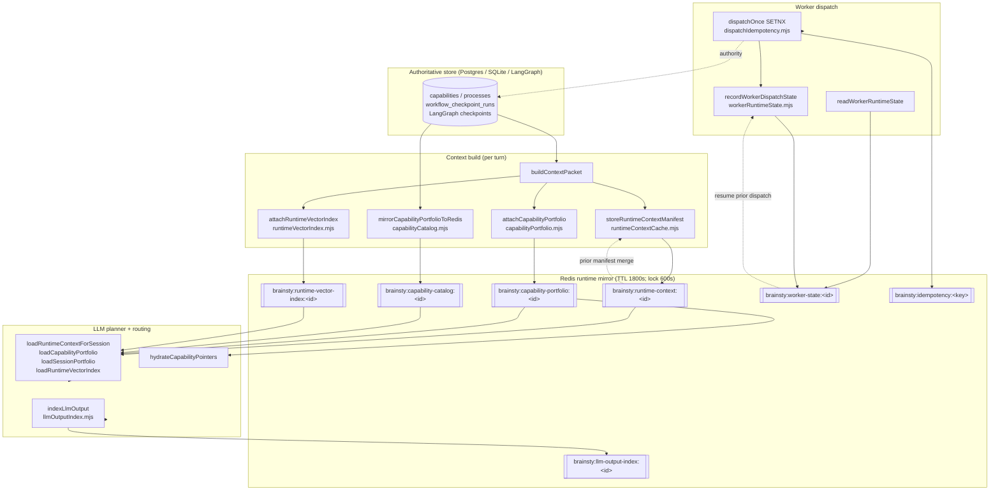

# Redis Data Layer — Runtime Mirror

> Healthcare AI concierge. This document describes the Redis **runtime mirror**: a
> fast, TTL'd cache of session runtime state. **Postgres/SQLite is authoritative.**
> Redis holds derived, hydratable, pointer-based projections that let a session
> resume cross-turn without rebuilding context from scratch.

## Overview

- **Role.** Redis is the *fast runtime mirror*, never the source of truth. Every
  namespace is a projection of authoritative state (Postgres rows, LangGraph
  checkpoints, the in-context packet). Anything in Redis can be lost and rebuilt
  from Postgres — losing it costs latency, not correctness.
- **Fail-loud when required.** `redisRequired(env)`
  (`src/concierge/runtimeContextCache.mjs`) returns `true` when
  `BRAINSTY_REQUIRE_REDIS=1`, or when the runtime env
  (`BRAINSTY_RUNTIME_ENV` / `NODE_ENV` / `APP_ENV`) is one of
  `production`, `prod`, `staging`, `production-candidate`. When Redis is required,
  `initializeRuntimeCache()` runs a boot probe — `PING` **plus** a real
  write→read→delete round-trip — and **throws** if Redis is unavailable or if the
  backend silently scored as the in-process `memory` Map. It never lets a
  process-local Map masquerade as Redis-backed.
- **Backend selection.** `createRuntimeContextCache({ env })` reads
  `env.BRAINSTY_REDIS_URL || env.REDIS_URL`. If a URL is present it uses a minimal
  RESP client (`backend: "redis"`, supports `rediss://` TLS + `AUTH`); otherwise it
  falls back to an in-process `Map` (`backend: "memory"`, `productionReady: false`).
- **Hit/miss metrics.** Every `get` is instrumented (`instrument()` →
  `runtimeCacheMetrics`). Counters (`hits`, `misses`, `sets`, `deletes`, `errors`,
  `total`, `hitRate`, `lastBackend`) are exposed via `getRuntimeCacheMetrics()` and
  surfaced at **`/api/health` → `redisRuntime.cacheMetrics`**. Errors are counted,
  not hidden.
- **Default TTL.** 1800s (30 min) for all runtime projections; 600s for the
  short-lived idempotency lock.
- **Value encoding.** Every value is JSON, stored with `SET key <json> EX <ttl>`
  (the idempotency lock uses `SET ... NX EX`). Reads `JSON.parse` the payload.

## Namespace table

| Key pattern | Value type | TTL (s) | Writer fn (file) | Reader fn (file) | Purpose |
|---|---|---|---|---|---|
| `brainsty:capability-catalog:<sessionId>` | JSON object | 1800 | `mirrorCapabilityPortfolioToRedis` / `loadSessionPortfolio` on miss (`capabilityCatalog.mjs`) | `loadSessionPortfolio` (`capabilityCatalog.mjs`) | Postgres-sourced planner-facing capability/process catalog mirror (metadata-only prompt table + pointers; HOW hydrated separately). |
| `brainsty:capability-portfolio:<sessionId>` | JSON object | 1800 | `attachCapabilityPortfolio` (`capabilityPortfolio.mjs`) | `loadCapabilityPortfolio` / `hydrateCapabilityPointers` (`capabilityPortfolio.mjs`) | Per-turn portfolio fullPayload (workflows/skills/tools/graph paths) for dereferencing planner-selected pointers. |
| `brainsty:llm-output-index:<sessionId>` | JSON object | 1800 | `indexLlmOutput` (`llmOutputIndex.mjs`) | `loadLlmOutputIndex` (`llmOutputIndex.mjs`) | Bounded index (≤20) of LLM outputs: hash + pointer + parsed summary per step. Raw output never stored. |
| `brainsty:runtime-context:<sessionId>` | JSON object | 1800 | `storeRuntimeContextManifest` (`runtimeContextCache.mjs`) | `loadRuntimeContextForSession` (`runtimeContextCache.mjs`) | Cross-turn runtime context manifest: merged checkpoints, prior decision pointers, capability summary. |
| `brainsty:runtime-vector-index:<sessionId>` | JSON object | 1800 | `attachRuntimeVectorIndex` (`runtimeVectorIndex.mjs`) | `loadRuntimeVectorIndex` (`runtimeVectorIndex.mjs`) | Deterministic local lexical term-vector index over portfolio/checkpoint/llm-output docs scored vs. user input. |
| `brainsty:worker-state:<sessionId>` | JSON object | 1800 | `recordWorkerDispatchState` (`workerRuntimeState.mjs`) | `readWorkerRuntimeState` (`workerRuntimeState.mjs`) | Per-session worker runtime: bounded (≤10) dispatch history + latest dispatch, read back across turns. |
| `brainsty:idempotency:<idempotencyKey>` | JSON object via `SETNX` | 600 | `dispatchOnce` `setNX` (`dispatchIdempotency.mjs`) | none (Postgres `UNIQUE` is authority) | Losable fast-path lock for exactly-once dispatch. Correctness is the Postgres `UNIQUE(idempotency_key)`. |

> The idempotency lock is short-lived (600s) and only exists during an in-flight
> dispatch, so it may be absent from a live dump. It is documented from
> `dispatchIdempotency.mjs` source.

## Orchestrator read/write flow (cross-turn hydration)



## Value shapes

The JSON shapes below are the **real top-level value shapes** captured from the live
Redis (`127.0.0.1:6381`). Nested objects/arrays are summarized as
`object` / `array[n] of {fields}` to reflect what was actually present. No fields
are invented.

### `brainsty:capability-catalog:<sessionId>`

Postgres-sourced (authoritative) planner-facing catalog mirror. The `promptTable` is
metadata-only (the *when/why/short_description* "planner half"); the executable HOW is
never here — it is dereferenced via `hydrateCapabilityPointer`. Evicted on capability
quarantine / demote / lifecycle-sync (`evictSessions`).

```json
{
  "version": "string",
  "cacheKey": "string",
  "sessionId": "string",
  "promptTable": "array[19] of {portfolioId, kind, title, whenToUse, whyUse, shortDescription, approvalScope, pointer, score}",
  "entries": {
    "process:portal_readonly_lookup": "object {portfolioId, kind, pointer}",
    "workflow:claim_status_navigation": "object",
    "workflow:eligibility_benefits_navigation": "object",
    "workflow:pharmacy_formulary": "object",
    "workflow:prior_authorization_navigation": "object",
    "workflow:document_or_trace_review": "object",
    "workflow:payer_portal_read_only_extraction": "object",
    "workflow:denial_appeal_preparation": "object",
    "skill:insurance_portal_browser": "object",
    "skill:insurance_knowledge_research": "object",
    "tool:openclaw_authenticated_browser": "object",
    "tool:payer_portal_reader": "object",
    "tool:aetna_cpb_lookup": "object",
    "tool:cms_mcd_lookup": "object",
    "tool:document_trace_parser": "object",
    "graph_path:approval_interrupt_resume": "object",
    "graph_path:evidence_to_sourced_answer": "object",
    "graph_path:input_policy_to_llm_planner": "object",
    "tool:web_search_authoritative_sources": "object"
  },
  "capabilityCount": "number",
  "processCount": "number"
}
```

- `promptTable` — the prompt-injected planner table; `pointer` is `"<cacheKey>#<portfolioId>"`.
- `entries` — map of `portfolioId` → `{ portfolioId, kind, pointer }` for hydration lookups.

### `brainsty:capability-portfolio:<sessionId>`

Per-turn portfolio `fullPayload` built from the context packet's
`workflowArchitecture`. This is the read-back half of the pointer architecture: the
LLM planner selects pointers, then `hydrateCapabilityPointers` resolves only the
selected entries from `entries`.

```json
{
  "version": "string",
  "cacheKey": "string",
  "generatedAt": "string",
  "sessionId": "string",
  "entryCount": "number",
  "entries": {
    "workflow:claim_status_navigation": "object (carries kind/title/pointer/score + nested hydrate payload)",
    "workflow:denial_appeal_preparation": "object",
    "workflow:document_or_trace_review": "object",
    "workflow:eligibility_benefits_navigation": "object",
    "workflow:human_approval_escalation": "object",
    "workflow:payer_portal_read_only_extraction": "object",
    "workflow:pharmacy_formulary": "object",
    "workflow:prior_authorization_navigation": "object",
    "skill:heartbeat_followup_planner": "object",
    "skill:insurance_knowledge_research": "object",
    "skill:insurance_portal_browser": "object",
    "tool:aetna_cpb_lookup": "object",
    "tool:browser_remote_debugger": "object",
    "tool:chrome_extension_bridge": "object",
    "tool:cms_icd10_lookup": "object",
    "tool:cms_mcd_lookup": "object",
    "tool:document_trace_parser": "object",
    "tool:gmail_inbox_reader": "object",
    "tool:hindsight_memory_adapter": "object",
    "tool:local_sqlite_memory": "object",
    "tool:mcp_browser_adapter": "object",
    "tool:openclaw_authenticated_browser": "object",
    "tool:payer_portal_reader": "object",
    "tool:vercel_ai_gateway": "object",
    "tool:web_search_authoritative_sources": "object",
    "tool:whatsapp_sender": "object",
    "graph:input_policy_to_llm_planner": "object",
    "graph:approval_interrupt_resume": "object",
    "graph:evidence_to_sourced_answer": "object"
  }
}
```

> Distinct from `capability-catalog`: the catalog is DB-sourced and metadata-only;
> the portfolio is per-turn context-packet-sourced and carries the nested `hydrate`
> payloads. The two keys coexist by design during the transition.

### `brainsty:llm-output-index:<sessionId>`

Bounded (≤20) index of LLM outputs per session. `rawOutputStored` is always `false` —
only hashes and parsed summaries are kept (no raw, potentially PHI-bearing output).

```json
{
  "version": "string",
  "sessionId": "string",
  "cacheBackend": "string",
  "key": "string",
  "latestOutputId": "string",
  "entries": "array[1] of {outputId, pointer, step, graphTraceId, model, modelTier, mode, outputHash, rawOutputStored, parsedSummary, createdAt}"
}
```

- `parsedSummary` — `{ workflow, intent, confidence, selectedCapabilityPortfolioIds, selectedCapabilityPointers, issueCount, warningCount }`.
- `pointer` — `"<key>#<outputId>"`; `entries` newest-first, capped at 20.

### `brainsty:runtime-context:<sessionId>`

Cross-turn runtime context manifest. On build, freshly compacted DB checkpoints are
merged with the previous cached manifest's `achievedCheckpoints` (dedup by
`checkpointId`, DB wins) so a resumed session inherits prior context —
`mergedFromPreviousCount` records how many were inherited.

```json
{
  "version": "string",
  "cacheKey": "string",
  "sessionId": "string",
  "threadId": "string",
  "generatedAt": "string",
  "previousManifestHash": "string",
  "mergedFromPreviousCount": "number",
  "latestCheckpoint": {
    "checkpointId": "string",
    "stepName": "string",
    "createdAt": "string",
    "stateVersion": "object",
    "workflow": "string",
    "routeReason": "string",
    "contextPacketId": "string",
    "sourcePointerCount": "number",
    "evidenceObservationStatus": "string"
  },
  "achievedCheckpoints": "array[1] of {checkpointId, stepName, createdAt, stateVersion, workflow, routeReason, contextPacketId, sourcePointerCount, evidenceObservationStatus}",
  "priorDecisionPointers": "array[1] of {checkpointId, stepName, workflow, routeReason, sourcePointerCount, contextPacketId}",
  "promptCompaction": {
    "strategy": "string",
    "checkpointLimit": "number",
    "contextPacketId": "object",
    "userInputHash": "string"
  },
  "capabilitySummary": "array[5] of {workflowKey, routeScore, executableNow, missingDataPointerCount, disabledToolCount}",
  "manifestHash": "string"
}
```

- `achievedCheckpoints` capped at 12; `priorDecisionPointers` capped at 4.
- `manifestHash` — 24-char sha of the manifest, chained via `previousManifestHash`.

### `brainsty:runtime-vector-index:<sessionId>`

Deterministic local lexical term-vector index. Documents come from the portfolio
prompt table, achieved checkpoints, and the LLM output index; each is cosine-scored
against the current user input. There is **no external embedding provider**
(`embeddingProvider: "none_local_fallback"`, `method:
"deterministic_lexical_term_vector"`).

```json
{
  "version": "string",
  "cacheKey": "string",
  "sessionId": "string",
  "generatedAt": "string",
  "queryHash": "string",
  "method": "string",
  "embeddingProvider": "string",
  "docCount": "number",
  "topMatches": "array[2] of {docId, kind, pointer, label, sourceId, textHash, score}",
  "docs": "array[18] of {docId, kind, pointer, label, sourceId, textHash, score}"
}
```

- `topMatches` — score-sorted, capped at 10 (only docs with score > 0).
- `docs` — all scored docs; `kind` ∈ `capability_portfolio` | `checkpoint` | `llm_output_pointer`.

### `brainsty:worker-state:<sessionId>`

Per-session stateful OpenClaw worker runtime, read back across dispatches/turns so the
worker resumes with prior observations instead of restarting context-blind. The
authoritative record remains the DB (`worker_continuations`, source pointers, audit).

```json
{
  "version": "string",
  "sessionId": "string",
  "threadId": "string",
  "dispatchCount": "number",
  "latestDispatch": {
    "dispatchedAt": "string",
    "workflow": "string",
    "skillKey": "string",
    "executionMode": "string",
    "plannerSelectedSkillKeys": "array[0]",
    "hydratedCapabilityCount": "number",
    "workerPlanId": "string",
    "browserReadinessTier": "string",
    "browserProductionReady": "boolean",
    "browserCdpUrl": "string"
  },
  "dispatchHistory": "array[1] of {dispatchedAt, workflow, skillKey, executionMode, plannerSelectedSkillKeys, hydratedCapabilityCount, workerPlanId, browserReadinessTier, browserProductionReady, browserCdpUrl}",
  "updatedAt": "string"
}
```

- `dispatchHistory` is bounded to the last 10 dispatches.

### `brainsty:idempotency:<idempotencyKey>`

Losable fast-path SETNX lock for exactly-once worker dispatch. **Not load-bearing** —
the Redis lock can be lost without affecting correctness because the authoritative
dedupe is the Postgres `UNIQUE(idempotency_key)` on `workflow_checkpoint_runs`. Written
with `SET ... NX EX 600` after the authoritative Postgres lock row is inserted.

> This namespace may be absent from a live dump because the lock is short-lived (600s)
> and only exists during an in-flight dispatch. Documented from
> `dispatchIdempotency.mjs` (no live shape captured).

```json
{
  "status": "string (e.g. \"in_progress\")",
  "runId": "string (workflowRunId)"
}
```

- `idempotencyKey` = `sha256("<runId>:<beforeWorkerCheckpointId>:<workerPlanSignature>")[:32]`,
  derived from the **persisted** selected capability pointers so reruns produce the same key.
