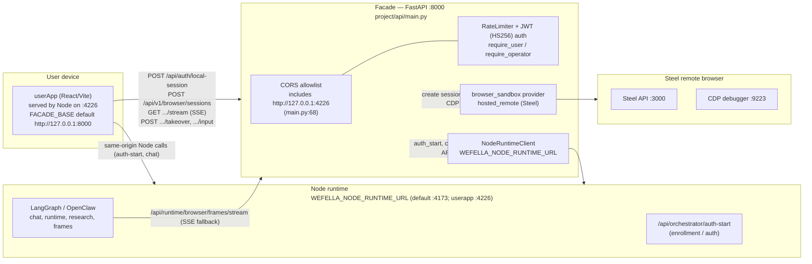
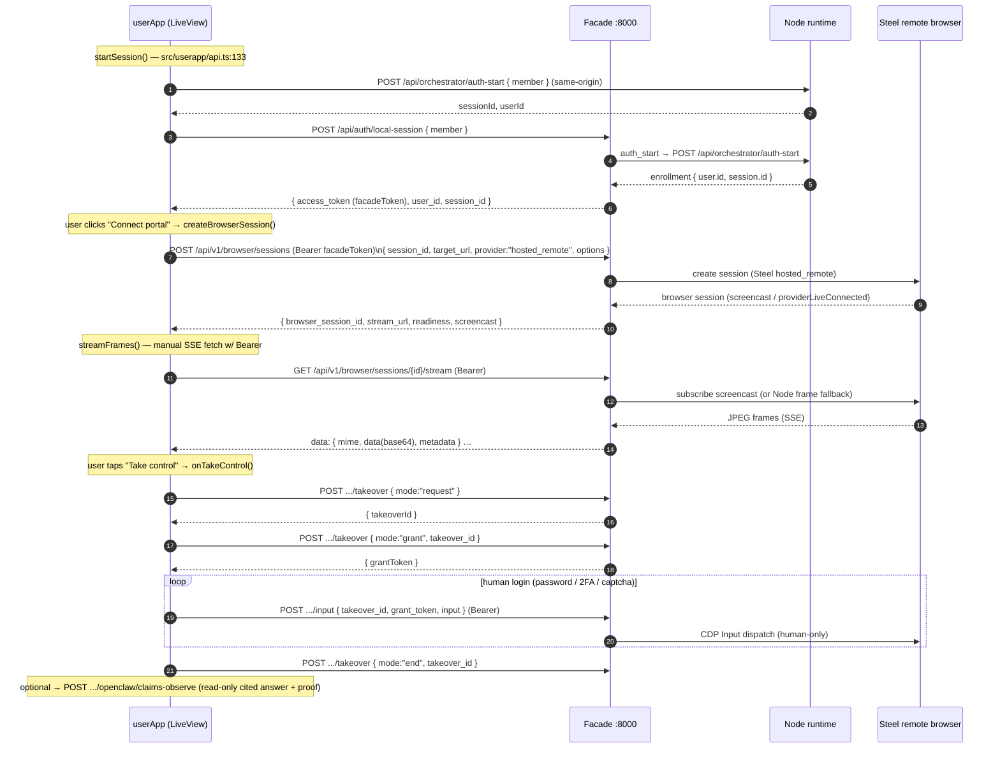

# FastAPI Facade + Live Remote-Browser Layer

> Source of truth: this document is derived only from the real files cited inline
> (`project/api/main.py`, `project/api/node_client.py`, `project/api/auth.py`,
> `project/api/local_env.py`, `project/api/hardening.py`, `src/userapp/api.ts`,
> `src/userapp/components/LiveView.tsx`, `package.json`, `.env.local`). File:line
> citations point at the exact definitions.

## 1. Purpose

The FastAPI "facade" is the public, authenticated edge of the healthcare AI
concierge. It does two jobs:

1. **Brokers Steel hosted remote-browser sessions + user takeover login.** The
   facade creates a provider-neutral browser session, streams real remote-browser
   pixels back to the user app over SSE, and relays the user's own
   mouse/keyboard/text when they explicitly "take control" to sign in, pass
   2FA/captcha, etc. (`project/api/main.py:445-532`,
   `src/userapp/components/LiveView.tsx`).
2. **Bridges to the Node runtime for enrollment/auth and everything else.** Most
   facade routes are thin, user-scoped proxies onto the internal Node runtime
   (LangGraph/OpenClaw) via `NodeRuntimeClient` (`project/api/node_client.py`).

The app is the `FastAPI` instance created in `create_app()`
(`project/api/main.py:208-209`, exported as module-level `app` at
`project/api/main.py:1579`). It runs on **port 8000**
(`package.json:57` `facade:dev`).

Key facts established by the code:

- **App title/version:** `"Wefella Concierge API"`, `VERSION =
  "0.1.0-phase10s-ai2ui-modes"` (`project/api/main.py:56`, `:209`).
- **Node runtime base URL:** `WEFELLA_NODE_RUNTIME_URL`, default
  `http://127.0.0.1:4173` (`project/api/node_client.py:12`). The user app
  comment refers to the Node server on `:4226` as same-origin
  (`src/userapp/api.ts:2-5`); the facade reaches Node via the configured env var
  regardless of port.
- **In-memory browser session store:** `app.state.browser_sessions`
  (`project/api/main.py:222`), keyed by `browser_session_id`. Sessions are
  user-scoped on read (`project/api/main.py:1166-1172`).

## 2. Topology



Notes:

- The default CORS allowlist explicitly includes `http://127.0.0.1:4226` (the
  user app port) plus `http://localhost:3000`, `http://127.0.0.1:4173`,
  `http://127.0.0.1:4174`, and `http://127.0.0.1:8000`
  (`project/api/main.py:68`). It can be overridden by
  `WEFELLA_ALLOWED_ORIGINS` (`project/api/main.py:64-69`).
- Steel ports `:3000` (API) and `:9223` (CDP) are loopback-pinned in the
  self-host/remote compose contract (`project/api/browser_sandbox.py:1862-1863`,
  `:1931-1933`).

## 3. Endpoint table

Auth column legend:
- **none** — no bearer required (rate-limited by IP).
- **local-gated** — no bearer, but requires `local_auth_enabled()` (returns 403
  otherwise); also calls the Node runtime (`project/api/auth.py:63-67`).
- **user** — `Depends(require_user)`; valid HS256 bearer required
  (`project/api/auth.py:177-181`).
- **operator** — `Depends(require_operator)`; bearer must carry `operator` or
  `admin` role (`project/api/auth.py:184-187`).

All routes run through `enforce_rate_limit(...)` (`project/api/main.py:1396-1402`).

### Core facade + live-browser routes

| Method | Path | Auth | Purpose | Calls |
| --- | --- | --- | --- | --- |
| GET | `/api/health` | none | Health + node reachability, auth/CORS/rate-limit metadata (`main.py:279`) | Node `GET /api/health` |
| GET | `/api/readiness` | none | Readiness checks, degraded if any error check fails (`main.py:297`) | Node `GET /api/health` |
| POST | `/api/auth/local-session` | local-gated | Mint facade JWT (`local_mvp_facade`) from Node enrollment (`main.py:309`) | Node `auth_start` → `/api/orchestrator/auth-start` |
| GET | `/api/v1/health` | none | v1 alias of `/api/health` (`main.py:328`) | Node `GET /api/health` |
| GET | `/api/v1/readiness` | none | v1 alias of `/api/readiness` (`main.py:346`) | Node `GET /api/health` |
| POST | `/api/v1/sessions` | local-gated | Mint facade JWT (`local_v1_connector`) from Node enrollment (`main.py:354`) | Node `auth_start` |
| POST | `/api/v1/tasks` | user | Create async chat task (queued/inline) (`main.py:380`) | Node `chat` → `/api/chat` |
| GET | `/api/v1/tasks/{task_id}` | user | Task lifecycle status + proposal/source pointers (`main.py:398`) | local registry |
| GET | `/api/v1/tasks/{task_id}/events` | user | SSE task event stream (`main.py:404`) | local registry |
| POST | `/api/v1/tasks/{task_id}/approvals` | user | Approve/deny a pending task proposal (`main.py:410`) | Node `POST /api/orchestrator/approve` |
| POST | `/api/v1/documents` | user | Create an upload record (`main.py:431`) | local upload store |
| GET | `/api/v1/openclaw/readiness` | user | OpenClaw official worker status (`main.py:440`) | Node `GET /api/openclaw/official/status` |
| POST | `/api/v1/browser/sessions` | user | **Create live remote-browser session** (Steel hosted_remote) (`main.py:445`) | browser_sandbox provider → Steel; provider may call Node |
| GET | `/api/v1/browser/sessions/{id}/stream` | user | **SSE frame stream** (harness / provider screencast / Node frame fallback) (`main.py:476`) | Steel screencast or Node `/api/runtime/browser/frames/stream` |
| POST | `/api/v1/browser/sessions/{id}/webrtc/offer` | user | Exchange opaque WebRTC offer/ICE refs (hosted_remote only) (`main.py:487`) | browser_sandbox provider → Steel |
| POST | `/api/v1/browser/sessions/{id}/input` | user | **Relay human CDP input** under an active takeover grant (`main.py:504`) | browser_sandbox provider → Steel CDP |
| POST | `/api/v1/browser/sessions/{id}/takeover` | user | **Takeover lifecycle** `request`/`grant`/`end` (`main.py:517`) | browser_sandbox provider; Node |
| POST | `/api/v1/browser/sessions/{id}/openclaw/claims-observe` | user | Read-only claims observation + cited answer + proof artifact (`main.py:534`) | provider `observe_claims_read_only`; Node `/api/portal-observation/final-answer` |
| POST | `/api/v1/browser/sessions/{id}/openclaw/explore` | user | Read-only portal exploration (`main.py:579`) | provider `explore_portal_read_only` |
| GET | `/api/v1/proof/runs/{run_id}` | user | Connector proof-run scorecard (`main.py:604`) | Node `GET /api/health` + sandbox contract |
| POST | `/api/chat` | user | Create async chat task; JWT sub must equal `user_id` (`main.py:611`) | Node `chat` → `/api/chat` |
| GET | `/api/chat/status/{task_id}` | user | Chat task status (`main.py:624`) | local registry |
| GET | `/api/chat/stream/{task_id}` | user | SSE chat task event stream (`main.py:630`) | local registry |
| POST | `/api/orchestrator/approve` | user | User-scoped approval passthrough (`main.py:636`) | Node `POST /api/orchestrator/approve` |
| GET | `/api/openclaw/official/status` | user | OpenClaw official worker status (`main.py:642`) | Node `GET /api/openclaw/official/status` |

### Node-runtime passthrough routes (user-scoped)

| Method | Path | Auth | Purpose | Calls (Node runtime path) |
| --- | --- | --- | --- | --- |
| GET | `/api/runtime/events` | user | Runtime events (`main.py:647`) | `/api/runtime/events` |
| GET | `/api/runtime/events/stream` | user | SSE runtime events (`main.py:653`) | `/api/runtime/events/stream` |
| GET | `/api/worker-continuations` | user | List worker continuations (`main.py:659`) | `/api/worker-continuations` |
| GET | `/api/handoffs` | user | List handoffs (`main.py:665`) | `/api/handoffs` |
| POST | `/api/worker-continuations` | user | Create continuation (`main.py:671`) | `/api/worker-continuations` |
| POST | `/api/worker-continuations/{id}/cancel` | user | Cancel continuation (`main.py:677`) | `/api/worker-continuations/{id}/cancel` |
| POST | `/api/worker-continuations/{id}/continue` | user | Continue continuation (`main.py:683`) | `/api/worker-continuations/{id}/continue` |
| GET | `/api/document-candidates` | user | List document candidates (`main.py:689`) | `/api/document-candidates` |
| POST | `/api/document-candidates/propose` | user | Propose document candidate (`main.py:695`) | `/api/document-candidates/propose` |
| POST | `/api/uploads` | user | Create upload (`main.py:701`) | local upload store |
| GET | `/api/uploads/{id}/extraction` | user | Upload extraction result (`main.py:710`) | local upload store |
| GET | `/api/sessions/{id}` | user | Session history (`main.py:719`) | `/api/sessions/{id}` |
| GET | `/api/sessions/{id}/export` | user | Session export (`main.py:724`) | `/api/sessions/{id}/export` |
| POST | `/api/feedback` | user | Submit feedback (`main.py:729`) | `/api/feedback` |

### Operator/admin research + ops routes (operator role required)

All require `require_operator` and proxy to Node, actor-scoped via
`body_for_actor` / `query_for_actor` (`project/api/main.py:1529-1546`).

| Method | Path | Node path | Def |
| --- | --- | --- | --- |
| GET | `/api/research/kpis` | `/api/research/kpis` | `main.py:744` |
| GET | `/api/research/analytics` | `/api/research/analytics` | `main.py:749` |
| GET | `/api/research/budget` | `/api/research/budget` | `main.py:754` |
| GET | `/api/research/review-queues` | `/api/research/review-queues` | `main.py:759` |
| POST | `/api/research/budget` | `/api/research/budget` | `main.py:764` |
| GET | `/api/research/worker-status` | `/api/research/worker-status` | `main.py:769` |
| GET | `/api/research/embeddings/status` | `/api/research/embeddings/status` | `main.py:774` |
| GET | `/api/research/graph` | `/api/research/graph` | `main.py:779` |
| POST | `/api/research/graph/build` | `/api/research/graph/build` | `main.py:784` |
| GET | `/api/research/citation-closure` | `/api/research/citation-closure` | `main.py:789` |
| POST | `/api/research/documents` | `/api/research/documents` | `main.py:794` |
| POST | `/api/research/citation-closure/evaluate` | `/api/research/citation-closure/evaluate` | `main.py:799` |
| POST | `/api/research/embeddings/route` | `/api/research/embeddings/route` | `main.py:804` |
| POST | `/api/research/embeddings/reindex` | `/api/research/embeddings/reindex` | `main.py:809` |
| GET | `/api/research/schedules` | `/api/research/schedules` | `main.py:814` |
| GET | `/api/research/scheduler/status` | `/api/research/scheduler/status` | `main.py:819` |
| GET | `/api/audit` | `/api/audit` | `main.py:824` |
| POST | `/api/research/scheduler/tick` | `/api/research/scheduler/tick` | `main.py:829` |
| POST | `/api/research/schedules/tick` | `/api/research/schedules/tick` | `main.py:834` |
| GET | `/api/operator/tools` | `/api/operator/tools` | `main.py:839` |
| GET | `/api/operator/proposals` | `/api/operator/proposals` | `main.py:844` |
| POST | `/api/operator/assistant` | `/api/operator/assistant` | `main.py:849` |
| POST | `/api/operator/proposals/{id}/approve` | `/api/operator/proposals/{id}/approve` | `main.py:854` |
| POST | `/api/operator/proposals/{id}/reject` | `/api/operator/proposals/{id}/reject` | `main.py:859` |
| GET | `/api/research/artifacts` | `/api/research/artifacts` | `main.py:864` |
| GET | `/api/research/entities` | `/api/research/entities` | `main.py:869` |
| POST | `/api/research/artifacts/{id}/entities/extract` | `/api/research/artifacts/{id}/entities/extract` | `main.py:874` |
| POST | `/api/research/artifacts/{id}/review` | `/api/research/artifacts/{id}/review` | `main.py:879` |
| GET | `/api/research/search` | `/api/research/search` | `main.py:884` |
| GET | `/api/research/evidence` | `/api/research/evidence` | `main.py:889` |
| GET | `/api/research/runs` | `/api/research/runs` | `main.py:894` |
| POST | `/api/research/runs` | `/api/research/runs` | `main.py:899` |
| GET | `/api/research/runs/{id}` | `/api/research/runs/{id}` | `main.py:904` |
| GET | `/api/research/runs/{id}/events` | `/api/research/runs/{id}/events` | `main.py:909` |
| POST | `/api/research/runs/{id}/cancel` | `/api/research/runs/{id}/cancel` | `main.py:914` |
| POST | `/api/research/runs/{id}/retry` | `/api/research/runs/{id}/retry` | `main.py:919` |
| POST | `/api/research/runs/{id}/execute` | `/api/research/runs/{id}/execute` | `main.py:924` |
| GET | `/api/research/sources` | `/api/research/sources` | `main.py:929` |
| POST | `/api/research/sources/propose` | `/api/research/sources/propose` | `main.py:934` |
| POST | `/api/research/sources/{id}/approve` | `/api/research/sources/{id}/approve` | `main.py:939` |
| POST | `/api/research/sources/{id}/reject` | `/api/research/sources/{id}/reject` | `main.py:944` |
| PATCH | `/api/research/sources/{id}` | `/api/research/sources/{id}` | `main.py:949` |

**Total endpoints documented: 81** (24 core facade + live-browser, 14
user-scoped passthrough, 43 operator research/ops).

## 4. Live-portal flow (sequence)



Implementation references: `src/userapp/api.ts:133-148` (`startSession` +
facade token), `:180-211` (`createBrowserSession`), `:246-290` (`streamFrames`
— manual SSE read because `EventSource` cannot send an `Authorization` header),
`:215-236` (`takeover`), `:299-312` (`relayInput`),
`src/userapp/components/LiveView.tsx:70-112` (start + stream),
`:142-180` (take/return control), `:182-218` (read-only scan).

## 5. Configuration

### Environment variables (names only — values redacted)

Found in `.env.local` (`WEFELLA_*` names only):

- `WEFELLA_NODE_RUNTIME_URL` — Node runtime base URL the facade proxies to;
  default `http://127.0.0.1:4173` (`project/api/node_client.py:12`).
- `WEFELLA_BROWSER_SANDBOX_PROVIDER`
- `WEFELLA_BROWSER_SANDBOX_PROVIDER_NAME`
- `WEFELLA_BROWSER_SANDBOX_PROVIDER_READY`
- `WEFELLA_BROWSER_SANDBOX_CDP_URL`
- `WEFELLA_BROWSER_SANDBOX_STEEL_API_URL`
- `WEFELLA_BROWSER_SANDBOX_STEEL_DEV_DIRECT`
- `WEFELLA_BROWSER_SANDBOX_SCREENCAST_QUALITY`
- `WEFELLA_BROWSER_SANDBOX_SCREENCAST_EVERY_NTH_FRAME`
- `WEFELLA_BROWSER_SANDBOX_SCREENCAST_MAX_SECONDS`

Additional facade `WEFELLA_*` controls referenced in code (not necessarily in
`.env.local`):

- `WEFELLA_FACADE_LOAD_LOCAL_ENV` — gates `.env.local`/private-config loading;
  set to `1` by `facade:dev` (`project/api/local_env.py:164`, `package.json:57`).
- `WEFELLA_FACADE_LOCAL_ENV_FILE` — override repo-local env file path
  (`project/api/local_env.py:38`).
- `WEFELLA_FACADE_PRIVATE_ENV_FILE` — override private Steel config path; default
  candidates under `~/.config/workerprototype_openclaw/phase30|phase28/`
  (`project/api/local_env.py:54-60`).
- `WEFELLA_FACADE_URL` — base URL used by the smoke client (`project/api/smoke.py:10`).
- `WEFELLA_BROWSER_SANDBOX_ENDPOINT_URL` — aliased into
  `WEFELLA_BROWSER_SANDBOX_STEEL_API_URL` when provider is `steel-self-host`
  (`project/api/local_env.py:92-112`).
- `WEFELLA_ALLOWED_ORIGINS` — CORS allowlist override (`project/api/main.py:64-69`).
- `WEFELLA_AUTH_MODE` (default `local`), `WEFELLA_ENABLE_LOCAL_AUTH`,
  `WEFELLA_JWT_SECRET` / `JWT_SECRET`, `WEFELLA_JWT_ISSUER`,
  `WEFELLA_JWT_AUDIENCE` (`project/api/auth.py:39-67`).
- `WEFELLA_RATE_LIMIT_PER_MINUTE` (default 120), `WEFELLA_RATE_LIMIT_DISABLED`
  (`project/api/hardening.py:46-47`).
- `WEFELLA_TASK_REGISTRY_PATH`, `WEFELLA_CLAIMS_OBSERVE_PROOF_DIR`
  (`project/api/main.py:218`, `:101`).

### Ports

| Component | Port | Source |
| --- | --- | --- |
| Facade (FastAPI) | 8000 | `package.json:57`, `src/userapp/api.ts:84` |
| User app (`FACADE_BASE` default) | client → `http://127.0.0.1:8000` | `src/userapp/api.ts:84` |
| User app origin (CORS-allowlisted) | 4226 | `project/api/main.py:68`, `src/userapp/api.ts:2` |
| Node runtime (default) | 4173 | `project/api/node_client.py:12` |
| Steel API | 3000 | `project/api/browser_sandbox.py:1862` |
| Steel CDP debugger | 9223 | `project/api/browser_sandbox.py:1863` |

### Run command

```bash
# package.json:57
WEFELLA_FACADE_LOAD_LOCAL_ENV=1 python3 -m uvicorn project.api.main:app --host 127.0.0.1 --port 8000
# i.e.
npm run facade:dev

# facade test suite (package.json:58)
npm run test:facade   # python3 -m unittest project.tests.test_fastapi_facade
```

### Known failure mode — "Live browser needs a facade session token"

The user app throws **"Live browser needs a facade session token (facade
unreachable at start)."** from `createBrowserSession` when `session.facadeToken`
is null (`src/userapp/api.ts:181-183`).

The token is set best-effort during `startSession` by calling
`POST /api/auth/local-session`; if that call fails the catch sets
`facadeToken = null` and chat still works while live view reports the error
(`src/userapp/api.ts:138-145`). Root causes:

- **Facade (:8000) is down** — the `POST /api/auth/local-session` request never
  succeeds.
- **Node runtime is not on the configured port** — `local-session` calls
  `node_client.auth_start` → `/api/orchestrator/auth-start`
  (`project/api/main.py:314`, `project/api/node_client.py:74-80`); an
  unreachable/wrong `WEFELLA_NODE_RUNTIME_URL` makes the facade return an error
  and no token is minted.
- **User app not on a CORS-allowlisted origin** — the browser must serve the user
  app from a CORS-allowlisted port (notably `http://127.0.0.1:4226`) or the
  cross-origin facade calls are blocked before a token can be obtained
  (`project/api/main.py:68`). If `local_auth_enabled()` is false the
  `local-session` route returns 403 (`project/api/main.py:312-313`,
  `project/api/auth.py:63-67`).

The error UI also surfaces the resolved `FACADE_BASE_URL`
(`src/userapp/components/LiveView.tsx:344`) to make the unreachable target
obvious.

## 6. How to run the full live stack

1. **Steel remote browser** — bring up the Steel API (`:3000`) and CDP debugger
   (`:9223`); point the facade at it via the
   `WEFELLA_BROWSER_SANDBOX_STEEL_API_URL` / `WEFELLA_BROWSER_SANDBOX_CDP_URL`
   (or `..._ENDPOINT_URL` for `steel-self-host`) config in `.env.local` or the
   private config under `~/.config/workerprototype_openclaw/`
   (`project/api/local_env.py:53-112`).
2. **Node runtime** — start the Node app that serves the user app and exposes
   `/api/orchestrator/auth-start`, `/api/chat`, `/api/runtime/...`, etc. The user
   app is served by Node and is expected on `:4226` (a CORS-allowlisted origin,
   `src/userapp/api.ts:2`, `project/api/main.py:68`). The facade reaches Node via
   `WEFELLA_NODE_RUNTIME_URL` (default `:4173`,
   `project/api/node_client.py:12`).
3. **Facade** — `npm run facade:dev` (uvicorn on `:8000` with
   `WEFELLA_FACADE_LOAD_LOCAL_ENV=1`, `package.json:57`).
4. **Verify** — `GET http://127.0.0.1:8000/api/health` should report
   `node_runtime_ok: true` and a CORS block whose `allowed_origins` includes
   `http://127.0.0.1:4226` (`project/api/main.py:279-295`). Then open the user
   app on `:4226`, which auto-mints a facade token and enables the live portal.
```
