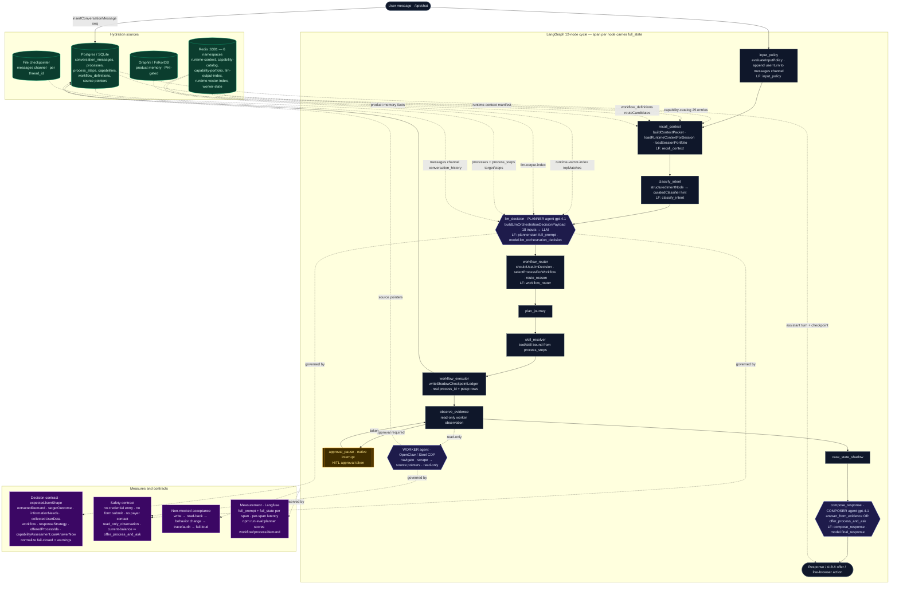
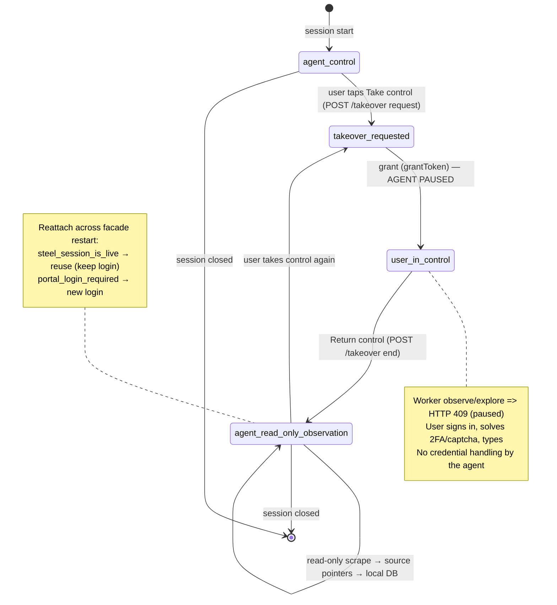

# Orchestration Flow — hydration points, agent states, measures & contracts

Validated Mermaid (renders in GitHub / Mermaid Live). Three views: the runtime cycle with every
hydration source + agent + Langfuse span; the agent/takeover state machine; and the
hydration + contracts reference tables.

Legend: **green** = hydration store · **indigo** = LLM/worker agent · **slate** = deterministic
node · **purple** = contract/measure · **amber** = HITL gate. `LF:` = the Langfuse span where it
shows (open `planner.start → Input.full_prompt` for the full hydrated decision input; every node
span carries `full_state`).

## 1. Runtime cycle — nodes, hydration, agents, contracts

## 2. Agent state machine (control + worker authority)

## 3. Hydration points (where each input is loaded)

| Input | Function | Store | Node / Langfuse span |
|---|---|---|---|
| conversation timeline | `insertConversationMessage` (seq) | Postgres `conversation_messages` | pre-graph |
| messages channel / conversation_history | `inputPolicyNode` append + checkpointer | File checkpointer (authoritative DB) | `input_policy` → read at `llm_decision` |
| deterministicPolicy | `evaluateInputPolicy` | computed | `input_policy` |
| runtimeContext manifest | `loadRuntimeContextForSession` | **Redis** runtime-context | `recall_context` |
| capabilityPortfolio (25) | `loadSessionPortfolio` | **Redis** capability-catalog ← DB processes+capabilities | `recall_context` → payload at `planner.start` |
| offerableProcesses + target/steps | `loadSessionPortfolio` + process_steps batch query | DB processes/process_steps | `llm_decision` payload |
| routeCandidates | workflow architecture readiness | DB workflow_definitions | `recall_context` |
| runtimeVectorContext / llmOutputIndex | memoryHarness | **Redis** runtime-vector-index / llm-output-index | `planner.start` payload |
| productMemory | `recallProductMemoryForRequest` | Graphiti/FalkorDB (PHI-gated) | `recall_context` |
| source pointers | `evidenceObservationNode` / worker | DB extraction_artifacts, portal_page_snapshots | `observe_evidence` |

## 4. Measures & contracts

| Contract / measure | Where | Enforced by |
|---|---|---|
| Decision contract (22 fields incl. demand extraction) | planner output | `expectedJsonShape` + `normalizeLlmOrchestrationDecision` (fail-closed defaults + warnings) |
| Safety boundary | planner + worker | system prompt rules + `openclawCapabilityPolicy` + facade safety contract |
| Takeover state machine + agent pause | facade | `/takeover` states + 409 guard on observe/explore |
| Process-driven execution | runtime | `selectProcessForWorkflow` → real `process_id`/`pstep` ledger; `resumeRun` iterates steps |
| Non-mocked acceptance | tests | write → read-back → behavior change → trace/audit → fail-loud |
| Measurement | Langfuse + eval | `full_prompt`/`full_state` per span + per-span latency; `npm run eval:planner` |
