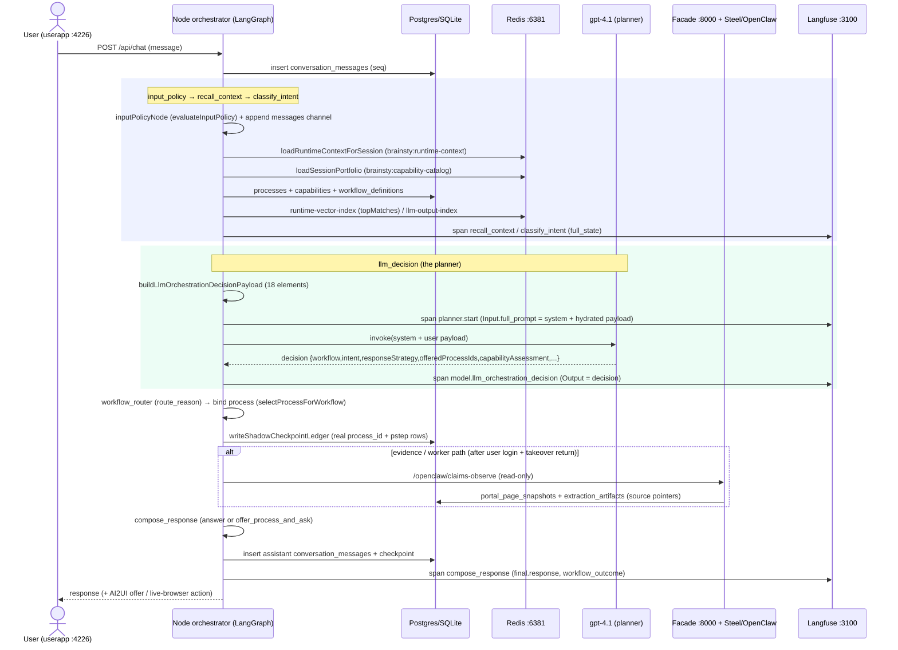

# Orchestrator Planner — Decision Inputs, Hydration & Improvement Assessment

How the planner agent decides **(1) what the user demands** and **(2) which workflow / process /
skill / tool to use** — every information element, where it is hydrated from (DB + Redis), the
exact function, and where to find it in Langfuse. Plus a concrete real hydrated case and concrete
levers to raise decision quality.

Captured live 2026-06-29 from a real turn: *"why was my last claim denied and what do I still owe?"*
→ decision `workflow=claim_status_navigation, intent=claim_denial_and_patient_owe, confidence=0.97`.

---

## 1. The planner decision = one LLM call with two messages

- **System message** ("your job" + hard rules): `buildLlmOrchestrationDecisionMessages()[0]`
  (`src/concierge/llmOrchestrationDecision.mjs`). Constant policy: allowed workflows, never enter
  credentials, *reason as a process*, current-balance ⇒ `offer_process_and_ask`, brevity.
- **User message** = the hydrated decision payload: `buildLlmOrchestrationDecisionPayload(state)`
  (same file). 18 elements below.
- Assembled + invoked in **`llmOrchestrationDecisionNode(state)`** (`src/concierge/langgraphRunner.mjs:910`),
  model `gpt-4.1` via `createTieredChatModel("llm_orchestration_decision")`.

**Langfuse:** the whole hydrated payload + system prompt = span **`planner.start`** → Input →
`full_prompt`; the raw model call + decision = **`model.llm_orchestration_decision`** (Input
`full_prompt`, Output = decision JSON); the node itself = **`llm_decision`** (Input `full_state`).

---

## 2. The 18 decision inputs — element → source/function → DB/Redis → Langfuse → role

| # | Element (payload key) | Hydrated by (function) | Store | Langfuse location | Role in the decision |
|---|---|---|---|---|---|
| 1 | `userInput` | `maskDirectIdentifiers` | request | `planner.start`.full_prompt[user].userInput | the raw demand |
| 2 | `conversationHistory` | `llmOrchestrationDecisionNode` reads `state.messages` (the native channel) | LangGraph checkpointer (file) + `conversation_messages` (DB authoritative) | every node `full_state.conversation_history`; payload.conversationHistory | multi-turn demand + "don't re-ask / advance on accept" |
| 3 | `deterministicPolicy` | `evaluateInputPolicy` in `inputPolicyNode` | computed | span `input_policy`; payload.deterministicPolicy | allowed / approvalRequired / failed safety checks |
| 4 | `curatedClassifier` | `structuredIntentNode` (deterministic + optional live reasoner) | computed | span `classify_intent`; payload.curatedClassifier | intent **hint** (NOT authority) |
| 5 | `routeCandidates` | `recallContextNode` → workflow architecture readiness | DB `workflow_definitions` | span `recall_context`; payload.routeCandidates | which workflows are runnable + `routeScore` |
| 6 | `sourcePointers` | `evidenceObservationNode` (empty pre-evidence) | DB `extraction_artifacts`/`portal_page_snapshots` | payload.sourcePointers | can we answer from cited evidence now |
| 7 | `dynamicSkills` | `skillResolver` → `state.dynamic_skill_context` | DB `openclaw_skills` | payload.dynamicSkills | skill-match hint |
| 8 | `memorySkillTree` | memory skill tree builder | DB `memory_items` | payload.memorySkillTree | learned procedural memory |
| 9 | `productMemory` | `recallProductMemoryForRequest` | Graphiti/FalkorDB (PHI-gated) | payload.productMemory | member-specific recalled facts |
| 10 | `runtimeContext` | `memoryHarness.loadRuntimeContextForSession` | **Redis** `brainsty:runtime-context:<sid>` | span `recall_context`; payload.runtimeContext | prior checkpoints + decision pointers (cross-turn) |
| 11 | `capabilityPortfolio` | **`loadSessionPortfolio`** (`capabilityCatalog.mjs`) | **Redis** `brainsty:capability-catalog:<sid>` ← DB `processes`+`capabilities` | payload.capabilityPortfolio (`cacheBackend=redis`, `entryCount=25`) | **THE selection surface**: workflows/skills/tools/graph_paths with when/why/score/pointer |
| 12 | `offerableProcesses` | `loadSessionPortfolio` (process rows) | DB `processes` (mirrored Redis) | payload.offerableProcesses (7) | the processes the planner may OFFER |
| 13 | `llmOutputIndex` | `memoryHarness.loadLlmOutputIndex` | **Redis** `brainsty:llm-output-index:<sid>` | payload.llmOutputIndex | reuse prior LLM outputs |
| 14 | `runtimeVectorContext` | runtime vector index | **Redis** `brainsty:runtime-vector-index:<sid>` | payload.runtimeVectorContext (`topMatches=10`) | semantic relevance of capabilities to the query |
| 15 | `checkpointResumePlan` | `buildCheckpointResumePlan` (from runtimeContext) | derived (Redis) | payload.checkpointResumePlan | resume vs restart |
| 16 | `openclawCapabilityPolicy` | constant | — | payload.openclawCapabilityPolicy | static worker safety boundary |
| 17 | `expectedJsonShape` | constant | — | payload.expectedJsonShape | the output contract (workflow, responseStrategy, offeredProcessIds, capabilityAssessment, selectedCapabilityPortfolioIds…) |
| 18 | system prompt | `buildLlmOrchestrationDecisionMessages` | — | `planner.start`.full_prompt[system] | the decision policy / "your job" |

**Worker (Steel/OpenClaw) read-only observation** is a *separate* downstream agent path
(`observe_claims_read_only` / `explore_portal_read_only` in `project/api/browser_sandbox.py`),
gated by the takeover state machine; it does not make the workflow decision.

---

## 3. Concrete final hydration (real, this turn)

Stores actually populated (live, Redis port **6381**, TTL ~1800s):
```
brainsty:runtime-context:<sid>      manifestHash, achievedCheckpoints=1, capabilitySummary=5, priorDecisionPointers
brainsty:capability-catalog:<sid>   25 entries  (kinds: process, workflow, skill, tool, graph_path)
brainsty:capability-portfolio:<sid> full hydratable capability payloads
brainsty:llm-output-index:<sid>     prior LLM outputs
brainsty:runtime-vector-index:<sid> topMatches=10 (semantic)
brainsty:worker-state:<sid>         worker lease/state
```
DB selectable surface: `capabilities` = workflow:7, tool:6, skill:2, graph_path:3;
`workflow_definitions` = 8; `processes` = 8 bound 1:1 to workflows:
```
eligibility_benefits_navigation -> process:portal_readonly_lookup
claim_status_navigation         -> process:claim_status_lookup
pharmacy_formulary              -> process:pharmacy_formulary_lookup
prior_authorization_navigation  -> process:prior_auth_lookup
payer_portal_read_only_extraction -> process:portal_extraction
denial_appeal_preparation       -> process:denial_appeal_support
document_or_trace_review         -> process:document_review
human_approval_escalation        -> process:human_approval
```
Planner payload for the turn (from Langfuse `planner.start`): `conversationHistory=0`,
`offerableProcesses=7`, `routeCandidates=5`, `capabilityPortfolio.entryCount=25` (redis),
`runtimeContext.status=miss`, `llmOutputIndex.status=miss`, `runtimeVectorContext.topMatches=10`.
Decision: `claim_status_navigation` / `claim_denial_and_patient_owe` / conf 0.97 / requiredEvidence
`[claim_record, …]`.

---

## 4. Assessment — how to raise decision quality

### A. Extracting the user demand/needs
What it has now: `userInput` + `conversationHistory` (native channel) + `curatedClassifier` (hint) +
`productMemory`. Gaps + levers:
1. **Demand is implicit, not first-class.** The planner infers it but never *states* it as a field.
   → Add `extractedDemand` + `targetOutcome` + `informationNeeds[]` to `expectedJsonShape`
   (`llmOrchestrationDecision.mjs`). Makes extraction measurable + traceable (it becomes a
   `model.llm_orchestration_decision` output field you can eval).
2. **No structured slot memory.** "Don't re-ask payer/member-id/the data they want" relies on
   re-reading `conversationHistory` text. → Add a `collectedUserData` slot accumulator
   (filled vs missing) hydrated from session memory + updated each turn → targeted clarification,
   no re-asking. (Build in `buildContextPacket`/`memoryHarness`, surface in the payload.)
3. **Member profile under-used.** `productMemory` is PHI-gated/empty in dev. → Surface a safe
   member profile (payer, plan, known prior intents) so extraction is grounded in *who* is asking.

### B. Selecting workflow / process / skill / tool
What it has now: `capabilityPortfolio` (25) + `offerableProcesses` (7) + `routeCandidates` (5, scored) +
`runtimeVectorContext` (10). Gaps + levers:
1. **`routeScore` is mostly 0** → no ranking signal. → Improve the workflow-architecture readiness
   scoring (`workflowArchitecture.mjs`) so the planner sees a real ranked candidate list.
2. **The planner can't see process feasibility.** `offerableProcesses` shows when/why but not the
   ordered steps → target. → Surface each process's `target` + step summary (from `process_steps`)
   so the planner reasons "can these steps reach the user's target?" (hydrate in `loadSessionPortfolio`).
3. **Tool/skill choice is not load-bearing.** The planner emits `selectedCapabilityPortfolioIds` but
   `skill_resolver`/`workflow_executor` pick deterministically, and `process_steps.capability_id`
   now binds tools per step. → Decide one owner: let the **process steps** drive tool/skill selection
   (reliable) and keep the planner choosing **workflow + process**; drop or de-emphasize LLM tool
   picking. This is the biggest reliability lever now that processes are authored.
4. **Semantic match quality.** `runtimeVectorContext.topMatches` ranks capabilities by embedding —
   if weak, it mis-ranks. → Verify the embedding/query in the runtime vector index against the eval set.

### C. Make it measurable (the real win)
Build an **eval set**: lay-person questions → expected `{workflow, process, missingData, demand}`.
Replay through the planner, read `full_state` + `model.llm_orchestration_decision` from Langfuse,
score accuracy of (demand extraction, workflow selection, process selection, clarification quality).
The full-state traces (now on every node) are the dataset; the `gate-*` tests are the seed.

---

## 5. Where to look in Langfuse (per trace)
- **`planner.start`** → Input.`full_prompt` = the complete hydrated decision input (all 18 elements
  + system prompt). This is the single most useful span for "why did it decide that?".
- **`model.llm_orchestration_decision`** → Input.`full_prompt`, Output = the decision JSON.
- **`llm_decision`** → Input.`full_state` (node view of the same).
- **`recall_context`** → the Redis runtime-context + capability-portfolio hydration (cache hit/miss).
- **`classify_intent`** → the deterministic classifier hint.
- **`workflow_router`** → `route_reason` (llm_orchestration_decision vs low_confidence vs
  llm_unavailable_no_silent_regex) — *why the route was taken*.
- **`compose_response`** → final answer + `workflow_outcome`.
- Every node span also carries `full_state` (Input) + the node's output patch + **per-span latency**
  (the performance lens). Requires `BRAINSTY_TRACE_FULL_PROMPTS` (dev default-on).

---

## 6. Runtime sequence diagram


