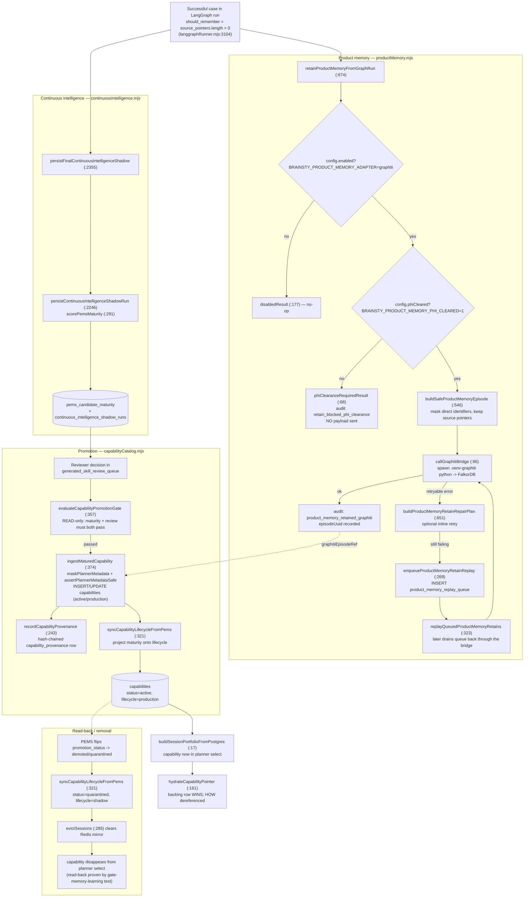

# PEMS — Product / Episodic Memory Subsystem

> Continuous-learning memory for the healthcare AI concierge. PEMS turns *successful, source-pointered cases* into reusable, reviewer-promoted capabilities — without ever persisting raw PHI/portal text by default.

This document is navigation-first and cites real code (`file:line`). Nothing here is invented; every function and column below was read out of the repository.

---

## 1. What PEMS is

PEMS is two cooperating halves wired together by the LangGraph runner:

| Half | File | Role |
| --- | --- | --- |
| **Product / episodic memory (Graphiti/Zep)** | `src/concierge/productMemory.mjs` | Retain a *safe* (PHI-masked, source-pointered) summary of each successful case into a Graphiti knowledge graph, and recall it on later requests. Failures fall back to a DB-backed replay queue. |
| **Continuous-intelligence scoring** | `src/concierge/continuousIntelligence.mjs` | Score case maturity (`scorePemsMaturity`, `continuousIntelligence.mjs:291`), persist shadow runs, and maintain the `pems_candidate_maturity` row that is the **maturity authority**. |
| **Capability lifecycle / promotion** | `src/concierge/capabilityCatalog.mjs` | Gate, ingest, hydrate, demote and quarantine capabilities. The matured + reviewer-approved candidate becomes a row in the authoritative `capabilities` catalog that the planner selects from. |

**Relation to the capability/process portfolio.** The planner-facing portfolio is built *from Postgres* (`buildSessionPortfolioFromPostgres`, `capabilityCatalog.mjs:17`) — only `status='active' AND lifecycle_state='production'` capabilities/processes appear. PEMS is the upstream loop that *adds* rows to that catalog (`ingestMaturedCapability`, `capabilityCatalog.mjs:374`) and later *removes* them (`syncCapabilityLifecycleFromPems`, `capabilityCatalog.mjs:321`). The catalog's metadata (the "when/why" the planner reads) is the only thing exposed to the prompt; the executable "HOW" stays behind `how_config_json` and is dereferenced only via `hydrateCapabilityPointer` (`capabilityCatalog.mjs:161`).

**Relation to Graphiti/Zep.** Product memory talks to a **Zep Graphiti** graph over a Python bridge (`tools/graphiti/graphiti_bridge.py`, run via `.venv-graphiti/bin/python`) — see `BRIDGE_PATH`/`DEFAULT_PYTHON_PATH` at `productMemory.mjs:12-13` and `callGraphitiBridge` at `productMemory.mjs:96`. The graph backend defaults to **FalkorDB** (`getProductMemoryConfig`, `productMemory.mjs:47-52`); the bridge's LLM/embeddings can run on OpenAI or Bedrock (`productMemory.mjs:53-63`).

---

## 2. The continuous-learning loop

Key semantics confirmed by the tests:

- `src/tests/gate-memory-learning.test.mjs` — a learned procedure is **absent** from the planner surface before promotion, the gate **refuses** an unreviewed candidate (`:34-35`), reviewer approval + `ingestMaturedCapability` makes the next session **see and USE** it (`:45-55`).
- `src/tests/capability-feed-end-to-end.test.mjs` — PHI (an SSN) is masked out of planner metadata (`:73`), provenance is hash-chained and the audit chain verifies (`:77-79`), and flipping `promotion_status` to `demoted` + `syncCapabilityLifecycleFromPems` **removes it from the planner surface** (`:82-85`).

---

## 3. Module & function map

### `src/concierge/productMemory.mjs` (Graphiti/Zep product memory)

| Function | file:line | What it does |
| --- | --- | --- |
| `getProductMemoryConfig` | `productMemory.mjs:37` | Reads env into a config object: adapter/enabled, bridge & python paths, `phiCleared`, FalkorDB host/port, group id, LLM/Bedrock model ids. |
| `productMemoryEnabled` (internal) | `productMemory.mjs:23` | `true` only when `BRAINSTY_PRODUCT_MEMORY_ADAPTER=graphiti`. |
| `productMemoryPhiCleared` (internal) | `productMemory.mjs:27` | `true` only when `BRAINSTY_PRODUCT_MEMORY_PHI_CLEARED=1`. |
| `callGraphitiBridge` (internal) | `productMemory.mjs:96` | Spawns `config.pythonPath config.bridgePath`, pipes JSON over stdin, records an outbound-payload observation, throws on non-`ok`. |
| `maskProductMemoryText` (internal) | `productMemory.mjs:89` | Masks direct identifiers + email/phone/SSN before any text leaves the process. |
| `buildSafeProductMemoryEpisode` | `productMemory.mjs:546` | Builds the masked, source-pointered episode body; sets `boundaries.rawPortalTextStored=false`, `directIdentifiersMasked=true`, `cortexProductMemory=false`. |
| `recallProductMemoryForRequest` | `productMemory.mjs:490` | Recalls facts from Graphiti for the current request (masked query). Disabled/PHI-gate aware. |
| `retainProductMemoryFromGraphRun` | `productMemory.mjs:674` | Main retain path: gate checks, build episode, call bridge, inline retry, enqueue replay on retryable failure, audit each branch. |
| `getProductMemoryStatus` | `productMemory.mjs:445` | Status probe of the bridge + replay-queue summary; fail-soft unless `requireEnabled`. |
| `getProductMemoryReplayQueueSummary` | `productMemory.mjs:209` | Aggregates `product_memory_replay_queue` by status (+ oldest pending). |
| `listProductMemoryReplayQueue` | `productMemory.mjs:247` | Lists queue rows (optionally filtered by status). |
| `enqueueProductMemoryRetainReplay` | `productMemory.mjs:269` | INSERTs a `queued` retain into `product_memory_replay_queue` with payload + repair plan; audits. |
| `replayQueuedProductMemoryRetains` | `productMemory.mjs:323` | Drains `queued`/`retryable_failed` rows back through the bridge; marks `running`/`completed`/`retryable_failed`/`failed` with backoff. |
| `isRetryableGraphitiRetainError` | `productMemory.mjs:644` | Policy/PHI errors are **non**-retryable; connection/timeout/Falkor errors are retryable. |
| `buildProductMemoryRetainRepairPlan` | `productMemory.mjs:651` | Classifies an error (retryable/timeout) and produces an operator `nextAction`. |
| `suppressProductMemoryEpisode` | `productMemory.mjs:848` | Suppresses (tombstones) a previously retained episode by `episodeUuid`. |
| `probeProductMemory` | `productMemory.mjs:875` | End-to-end probe: retain a synthetic safe episode then recall it. |
| `probeProductMemoryAtBoot` | `productMemory.mjs:945` | Fail-soft boot probe; logs adapter/backend/schema readiness. |

### `src/concierge/capabilityCatalog.mjs` (lifecycle / promotion)

| Function | file:line | What it does |
| --- | --- | --- |
| `buildSessionPortfolioFromPostgres` | `capabilityCatalog.mjs:17` | Authoritative planner manifest from Postgres: only `status='active' AND lifecycle_state='production'`. |
| `maskPlannerMetadata` | `capabilityCatalog.mjs:101` | Second-layer PHI scrub for planner columns; returns masked text + `phiCleared` verdict + rationale hash/preview. |
| `assertPlannerMetadataSafe` | `capabilityCatalog.mjs:123` | Throws `planner_metadata_unmasked_phi_detected` if residual PHI survives. |
| `hydrateCapabilityPointer` | `capabilityCatalog.mjs:161` | Dereferences a pointer to executable HOW — only after lifecycle + backing-row checks; **backing row wins** over the catalog row. |
| `evaluateCapabilityPromotionGate` | `capabilityCatalog.mjs:357` | READ-only gate: `pems_candidate_maturity` must be mature **and** the `generated_skill_review_queue` decision approved, and not demoted/quarantined. |
| `ingestMaturedCapability` | `capabilityCatalog.mjs:374` | If gate passes: mask metadata, INSERT/UPDATE `capabilities` (active/production), write provenance, then `syncCapabilityLifecycleFromPems`. |
| `feedCapabilityFromPemsEpisode` | `capabilityCatalog.mjs:426` | Thin orchestrator: ingest then best-effort mirror to Redis. |
| `recordCapabilityProvenance` | `capabilityCatalog.mjs:243` | Single write path for mutations: append-only **hash-chained** `capability_provenance` row + hash-chained `audit_events` entry (rationale PHI-masked). |
| `transitionCapabilityStatus` (internal) | `capabilityCatalog.mjs:297` | Flips `capabilities.status`/`lifecycle_state`, records provenance, evicts Redis sessions. |
| `quarantineCapability` | `capabilityCatalog.mjs:311` | Transition → `status=quarantined`, `lifecycle=shadow` (`source_kind='safety'`). |
| `demoteCapability` | `capabilityCatalog.mjs:315` | Transition → `status=demoted`, `lifecycle=shadow` (`source_kind='review'`). |
| `syncCapabilityLifecycleFromPems` | `capabilityCatalog.mjs:321` | Projects `pems_candidate_maturity.promotion_status`/`production_driving_allowed` onto `capabilities` lifecycle; this is the read-back writer that makes a PEMS demotion filter out of planner select. |
| `evictSessions` (internal) | `capabilityCatalog.mjs:285` | Best-effort delete of the Redis catalog mirror per session. |

### `src/concierge/continuousIntelligence.mjs` (maturity authority — selected)

| Function | file:line | What it does |
| --- | --- | --- |
| `scorePemsMaturity` | `continuousIntelligence.mjs:291` | Pure scorer (0–100): rewards shadow runs/evidence/outcomes/reviewer approvals; **safety incident = −35 each**; `trusted` requires threshold + min runs + min approvals + zero incidents. |
| `persistContinuousIntelligenceShadowRun` | `continuousIntelligence.mjs:2246` | Upserts `pems_candidate_maturity` and INSERTs `continuous_intelligence_shadow_runs`; sets `production_driving_allowed=0` on this path. |
| `persistFinalContinuousIntelligenceShadow` | `continuousIntelligence.mjs:2355` | Builds the case state from a finished run and persists the shadow. |
| `evaluatePemsPromotionGate` | `continuousIntelligence.mjs:847` | Supervised-promotion gate over maturity + reviews. |
| `recordPemsPromotionReview` | `continuousIntelligence.mjs:1029` | Records a reviewer decision into `pems_candidate_promotion_reviews`. |

> The runner wiring: `should_remember` is set true only when `state.source_pointers?.length > 0` (`langgraphRunner.mjs:3104`, `:3124`); retain/recall/persist are imported there (`langgraphRunner.mjs:8`, `:51`).

---

## 4. Tables that back PEMS

All defined in `src/concierge/schema.mjs`. Real columns below.

### `product_memory_replay_queue` — `schema.mjs:257`
DB-backed replay queue for failed Graphiti retains.
`id`, `user_id`, `session_id`, `adapter`, `action`, `status`, `attempts`, `max_attempts`, `source_pointer_count`, `payload_json`, `result_json`, `first_error`, `last_error`, `next_attempt_at`, `last_attempt_at`, `completed_at`, `created_at`, `updated_at` (FKs → `users`, `sessions`).

### `continuous_intelligence_shadow_runs` — `schema.mjs:730`
One row per shadow scoring of a case.
`id`, `user_id`, `session_id`, `graph_trace_id`, `case_ref`, `workflow`, `mode`, `gate_score`, `gate_passed`, `gate_total`, `pems_candidate_id`, `pems_score`, `pems_trusted`, `production_driving_allowed`, `source_pointer_count`, `workflow_outcome`, `final_response_prepared`, `shadow_json`, `safety_json`, `created_at` (FK → `sessions`).

### `pems_candidate_maturity` — `schema.mjs:754` — *the maturity authority*
`candidate_id` (PK), `workflow`, `selected_skill_key`, `shadow_run_count`, `evidence_ref_count`, `successful_outcome_count`, `reviewer_approval_count`, `authority_citation_count`, `validator_pass_count`, `safety_incident_count`, `latest_score`, `trusted`, `supervised_advisory_allowed`, `promotion_status` (default `shadow_review_required`), `last_reviewed_at`, `production_driving_allowed`, `maturity_json`, `promotion_json`, `created_at`, `updated_at`.

### `pems_candidate_promotion_reviews` — `schema.mjs:777`
`id`, `candidate_id`, `actor_user_id`, `review_type`, `decision`, `evidence_ref_count`, `validator_pass_count`, `safety_incident_count`, `rationale_hash`, `rationale_preview`, `metadata_json`, `created_at` (FK → `pems_candidate_maturity`).

### `pems_candidate_evaluator_drafts` — `schema.mjs:793`
`id`, `candidate_id`, `actor_user_id`, `draft_type`, `evaluator_mode`, `status`, `deterministic_validator_status`, `suggested_review_type`, `suggested_decision`, `advisory_note_hash`, `advisory_note_preview`, `consistency_trace_ref`, `consistency_trace_hash`, `consistency_trace_preview`, `metadata_json`, `created_at`, `updated_at` (FK → `pems_candidate_maturity`).

### `pems_candidate_claim_revisions` — `schema.mjs:814`
`id`, `candidate_id`, `advisory_draft_id`, `claim_id`, `actor_user_id`, `revision_status`, `original_claim_hash`, `original_claim_preview`, `suggested_edit_hash`, `suggested_edit_preview`, `revised_claim_hash`, `revised_claim_preview`, `source_pointer_ids_json`, `deterministic_reclosure_json`, `metadata_json`, `created_at`, `updated_at` (FKs → maturity, evaluator_drafts).

### `pems_candidate_review_followups` — `schema.mjs:836`
`id`, `candidate_id`, `advisory_draft_id`, `claim_revision_id`, `promotion_review_id`, `actor_user_id`, `followup_type`, `followup_status`, `workflow_status`, `revision_outcome`, `action_required`, `rationale_hash`, `rationale_preview`, `metadata_json`, `created_at`, `updated_at` (FKs → maturity, drafts, claim_revisions, promotion_reviews).

### `pems_candidate_review_history_exports` — `schema.mjs:859`
`id`, `candidate_id`, `advisory_draft_id`, `actor_user_id`, `export_reason_hash`, `export_reason_preview`, `filters_json`, `export_ref`, `export_hash`, `history_snapshot_hash`, `history_snapshot_preview_json`, `metadata_json`, `created_at`, `updated_at` (FKs → maturity, drafts).

### `pems_trusted_answer_driving_controls` — `schema.mjs:878`
Kill-switch control for trusted answer driving.
`control_key` (PK), `kill_switch_enabled`, `actor_user_id`, `reason_hash`, `reason_preview`, `metadata_json`, `created_at`, `updated_at`.

### `generated_skill_review_queue` — `schema.mjs:889` — *reviewer promotion queue*
`id`, `candidate_id`, `skill_key`, `package_hash`, `status`, `requested_action`, `gate_status`, `reviewer_user_id`, `review_decision`, `review_rationale_hash`, `review_rationale_preview`, `pr_branch_name`, `pr_title`, `package_json`, `executor_json`, `safety_json`, `created_at`, `updated_at`, `reviewed_at`.

### `generated_skill_pr_executor_runs` — `schema.mjs:911`
`id`, `queue_item_id`, `status`, `actor_user_id`, `operator_approval`, `dry_run`, `package_hash`, `branch_name`, `files_written`, `git_branch_created`, `pr_open_requested`, `pr_opened`, `output_json`, `safety_json`, `created_at`.

### `worker_procedural_memory` — `schema.mjs:929`
Persisted procedural traces for matured candidates.
`id`, `user_id`, `session_id`, `workflow`, `selected_skill_key`, `selected_executor_key`, `terminal_outcome`, `procedure_ref`, `procedure_hash`, `sequence_json`, `source_pointer_ids_json`, `pems_candidate_id`, `cortex_product_memory`, `production_driving_allowed`, `masked_preview`, `safety_json`, `metadata_json`, `created_at`, `updated_at` (FK → `sessions`).

### `capabilities` — `schema.mjs:1223` — *the planner-selected catalog*
`id`, `capability_key` (unique), `kind`, `status` (default `draft`), `lifecycle_state` (default `shadow`), `short_description`, `when_to_use`, `why_use`, `best_used_for`, `not_for`, `planner_tags_json`, `planner_score`, `planner_metadata_json`, `rationale_hash`, `rationale_preview`, `metadata_phi_cleared`, `pointer_cache_key`, `how_kind_ref`, `workflow_key`, `skill_key`, `tool_key`, `graph_subpath_json`, `how_config_json`, `how_config_hash`, `config_version`, `last_hydrated_at`, `hydrate_count`, `created_at`, `updated_at` (FKs → workflow_definitions, openclaw_skills, tool_registry).

### `capability_provenance` — `schema.mjs:1346` — *append-only, hash-chained lineage*
`id`, `capability_id`, `process_id`, `event_type`, `source_kind`, `from_status`, `to_status`, `pems_candidate_id`, `generated_skill_queue_id`, `graphiti_episode_ref`, `session_checkpoint_id`, `reviewer_user_id`, `rationale_preview`, `rationale_hash`, `source_pointer_ids_json`, `metadata_json`, `previous_event_hash`, `event_hash`, `created_at` (FKs → capabilities, processes).

> Migration note: `pems_candidate_maturity` gained `supervised_advisory_allowed`, `promotion_status`, `last_reviewed_at`, `promotion_json` via incremental ALTERs (`schema.mjs:1420-1424`).

---

## 5. Safety model

1. **PHI clearance gate (default OFF).** `BRAINSTY_PRODUCT_MEMORY_PHI_CLEARED` must equal `"1"` (`productMemory.mjs:27`). Until it does, every product-memory action returns `phiClearanceRequiredResult` (`productMemory.mjs:68`) and **no payload is sent** to the bridge. `retainProductMemoryFromGraphRun` additionally writes a `product_memory_retain_blocked_phi_clearance` audit event (`productMemory.mjs:692`). The message is explicit: only flip it once Bedrock/FalkorDB are confirmed inside the HIPAA boundary (`productMemory.mjs:83`).

2. **Masking, twice.** Outbound episodes are masked at the source — `maskProductMemoryText` strips direct identifiers, email, phone and SSN (`productMemory.mjs:89-94`) inside `buildSafeProductMemoryEpisode` (`productMemory.mjs:546`), which also sanitizes evidence fields/citations and reduces member/policy ids to `last4:` or `[DB_POINTER:...]`. Independently, before any catalog metadata reaches the planner prompt, `maskPlannerMetadata` (`capabilityCatalog.mjs:101`) re-scrubs and `assertPlannerMetadataSafe` (`capabilityCatalog.mjs:123`) throws if residual PHI (SSN/email/MRN/long digit runs) survives. `metadata_phi_cleared` is stored as 1/0 on the capability row.

3. **No raw portal text / no credentials.** Every safe episode carries `boundaries: { rawPortalTextStored: false, directIdentifiersMasked: true, cortexProductMemory: false, credentialStorage: "not_allowed", irreversiblePortalActions: "not_allowed" }` (`productMemory.mjs:595-602`). Raw portal text is opt-in only via `GRAPHITI_STORE_RAW_EPISODES=1` (`productMemory.mjs:64`).

4. **Hash-chained provenance.** `recordCapabilityProvenance` (`capabilityCatalog.mjs:243`) appends an immutable `capability_provenance` row whose `event_hash` chains off `previous_event_hash` (`capabilityCatalog.mjs:249-256`), and mirrors a hash-chained `audit_events` entry (verifiable via `verifyAuditChain`, asserted at `capability-feed-end-to-end.test.mjs:79`). Rationale is stored as hash + 180-char masked preview only.

5. **DB-backed replay queue.** Retryable Graphiti failures (connection/timeout/Falkor — `isRetryableGraphitiRetainError`, `productMemory.mjs:644`) are enqueued in `product_memory_replay_queue` (`enqueueProductMemoryRetainReplay`, `productMemory.mjs:269`) and drained later with capped exponential backoff and `max_attempts` (default 3) by `replayQueuedProductMemoryRetains` (`productMemory.mjs:323`, backoff `replayBackoffIso` `:264`). **Policy/PHI errors are non-retryable** and never auto-replay.

6. **Graphiti bridge + FalkorDB isolation.** All graph I/O is an out-of-process spawn of the Python bridge (`callGraphitiBridge`, `productMemory.mjs:96`) with an explicit env allow-list (backend, group id, model ids); the default backend is FalkorDB on `localhost:6380` (`productMemory.mjs:47-52`). Each call records an outbound-payload observation (`recordOutboundPayloadObservation`) so what leaves the process is auditable.

7. **No silent auto-promote.** Promotion is gated: `evaluateCapabilityPromotionGate` is READ-only and requires both PEMS maturity (`production_driving_allowed=1` or trusted `promotion_status`) **and** an approved `generated_skill_review_queue` decision, and refuses if demoted/quarantined (`capabilityCatalog.mjs:357-369`). Demotion/quarantine flips the catalog and evicts the Redis mirror so the change is read back on the next planner build (`syncCapabilityLifecycleFromPems`, `capabilityCatalog.mjs:321`; `evictSessions`, `:285`).

---

## 6. Flags & defaults

| Env var | Default | Effect |
| --- | --- | --- |
| `BRAINSTY_PRODUCT_MEMORY_ADAPTER` | `disabled` | Must be `graphiti` to enable product memory at all (`productMemory.mjs:23-24`, `:41`). Otherwise all actions return `disabledResult` (`:177`). |
| `BRAINSTY_PRODUCT_MEMORY_PHI_CLEARED` | unset (off) | Must be `1` to actually send any payload to Graphiti (`productMemory.mjs:27-28`). Default = no PHI leaves the process. |
| `BRAINSTY_PRODUCT_MEMORY_RETAIN_RETRY` | unset (retry on) | Set `0` to disable the inline retry before queuing replay (`productMemory.mjs:756`). |
| `BRAINSTY_PRODUCT_MEMORY_BOOT_PROBE_TIMEOUT_MS` | `5000` | Boot-probe timeout (`productMemory.mjs:948`). |
| `BRAINSTY_GRAPHITI_PYTHON` | `.venv-graphiti/bin/python` | Python interpreter for the bridge (`productMemory.mjs:31-35`, `:13`). |
| `GRAPHITI_BACKEND` / `GRAPHITI_DRIVER` | `falkordb` | Graph backend (`productMemory.mjs:47`). |
| `GRAPHITI_GROUP_ID` | `brainstyworkers_local` | Graphiti namespace/group (`productMemory.mjs:48`). |
| `GRAPHITI_LLM_PROVIDER` | `openai` | `openai` or Bedrock for the bridge LLM (`productMemory.mjs:38`, `:53`). |
| `GRAPHITI_LLM_MODEL` / `GRAPHITI_SMALL_MODEL` / `GRAPHITI_EMBEDDING_MODEL` | `gpt-4.1-mini` / `gpt-4.1-nano` / `text-embedding-3-small` | Model ids (`productMemory.mjs:54-56`). |
| `GRAPHITI_BEDROCK_*` | `anthropic.claude-3-5-sonnet…`, `…haiku…`, `amazon.titan-embed-text-v2:0`, dim `1024` | Bedrock model ids when provider is Bedrock (`productMemory.mjs:57-63`). |
| `FALKORDB_HOST` / `FALKORDB_PORT` | `localhost` / `6380` | FalkorDB connection (`productMemory.mjs:50-51`). |
| `GRAPHITI_STORE_RAW_EPISODES` | unset (off) | `1` allows raw episode storage; off by default keeps `rawPortalTextStored=false` (`productMemory.mjs:64`). |

**On by default:** the continuous-intelligence shadow scoring path (`persistContinuousIntelligenceShadowRun`) writes maturity/shadow rows with `production_driving_allowed=0` — i.e., it learns/scores but does **not** auto-drive production. The capability catalog read/hydrate path is always active (it just selects from Postgres).

**Off by default:** the Graphiti product-memory adapter (`disabled`), the PHI clearance gate, and raw-episode storage. With defaults, PEMS scores cases and can promote capabilities through the reviewer gate, but **never transmits PHI to Graphiti** until an operator explicitly clears the boundary.
