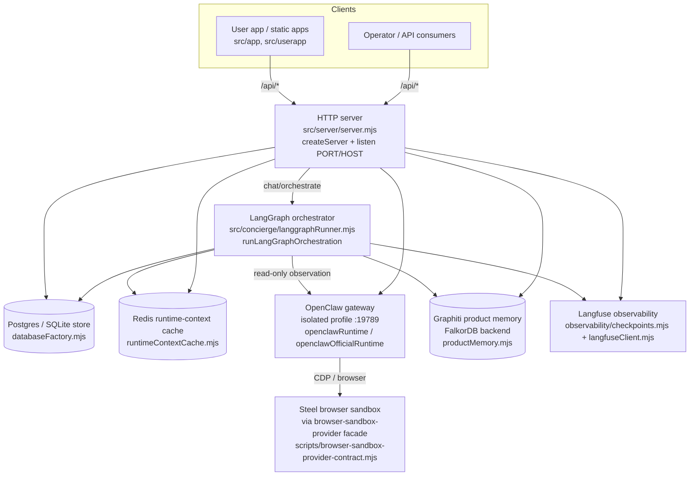

# System Architecture — Brainstyworkers AI Concierge

> Navigation map for developers. Every claim below was verified by reading the cited
> source file. Paths are repo-relative; line numbers are approximate anchors valid at
> time of writing. Where a fact could not be fully confirmed it is marked `(verify)`.

## 1. System overview

Brainstyworkers is a healthcare-insurance AI concierge: a single Node.js HTTP server
(`src/server/server.mjs`, package `brainstyworkers-ai-concierge`, ESM, Node >= 25) that
boots a durable runtime (Postgres/SQLite store, Redis runtime-context cache, an isolated
always-on OpenClaw browser-automation gateway, optional Graphiti/FalkorDB product memory,
and Langfuse observability) and serves a JSON API plus static apps. The core request
brain is a LangGraph orchestrator (`src/concierge/langgraphRunner.mjs`) of 12 nodes that
runs input safety policy, memory recall, structured + LLM intent decisioning, workflow
routing, journey planning, capability/skill resolution, read-only evidence observation
(with native human-in-the-loop approval interrupts), case-state shadowing and a final
sourced-answer composer. Capabilities/processes are seeded into a DB catalog and mirrored
to Redis; model calls are tiered per step; every node and model call emits Langfuse
checkpoints. Most advanced behaviors are gated behind `BRAINSTY_*` feature flags that
default to a safe/off posture.

## 2. System-context diagram

## 3. Module dependency / class diagram (core concierge)

```mermaid
classDiagram
  class server_mjs {
    +createServer() server
    +handleApi()
    +GET /api/health
    boot: initializeRuntimeCache, initializeOpenClawRuntime, createDatabaseStore, seedCapabilityCatalog
  }
  class langgraphRunner {
    +createBrainstyLangGraph()
    +runLangGraphOrchestration(store, ...)
    +BRAINSTY_GRAPH_NODE_NAMES
    +describeBrainstyLangGraphTopology()
    +getBrainstyLangGraphCheckpointState()
    -12 *Node functions
  }
  class modelTierPolicy {
    +selectModelForStep(step)
    +createTieredChatModel(step)
    STEP_TIERS, DEFAULT_MODELS
  }
  class llmOrchestrationDecision {
    +buildLlmOrchestrationDecisionMessages()
    +normalizeLlmOrchestrationDecision()
    +shouldUseLlmDecision()
    +confidenceBand()
  }
  class plannerResponseComposer {
    +composeProcessOfferResponse()
  }
  class capabilityCatalog {
    +loadSessionPortfolio()
    +hydrateCapabilityPointer()
    +acceptProcessOffer()
    +executeAcceptedProcess()
    +mirrorCapabilityPortfolioToRedis()
  }
  class capabilityCatalogSeed {
    +seedCapabilityCatalog()
    +CAPABILITY_CATALOG
    +validateCatalogGraphNodes()
  }
  class checkpointRunLedger {
    +runLedgerMode()
    +writeShadowCheckpointLedger()
    +resumeRun()
  }
  class dispatchIdempotency {
    +computeDispatchIdempotencyKey()
    +dispatchOnce()
  }
  class runtimeContextCache {
    +initializeRuntimeCache()
    +createRuntimeContextCache()
    +buildRuntimeContextManifest()
    +storeRuntimeContextManifest()
    +redisRequired()
  }
  class sessionManager {
    +createManagedSession()
    +checkpointSession()
    +getManagedSessionState()
  }
  class memoryHarness {
    +buildContextPacket()
    +retainMemoryFromSession()
    +runUserHeartbeat()
  }
  class openclawRuntime {
    +initializeOpenClawRuntime()
    +verifyOpenClawLlm()
  }
  class openclawOfficialRuntime {
    +getOfficialOpenClawConfig()
    +runOfficialOpenClawReadOnlyObservation()
    +checkOfficialOpenClawReadiness()
  }
  class checkpoints {
    +observedLangGraphNode()
    +withCheckpoint()
    +start_checkpoint()
    +runWithTraceContext()
  }
  class langfuseClient {
    +get_langfuse_client()
    +createLangfuseTrace()
    +shutdown_langfuse()
  }
  class databaseFactory {
    +createDatabaseStore(env)
    +resolveDatabaseDriver()
  }

  server_mjs --> langgraphRunner
  server_mjs --> runtimeContextCache
  server_mjs --> openclawRuntime
  server_mjs --> databaseFactory
  server_mjs --> capabilityCatalogSeed
  langgraphRunner --> modelTierPolicy
  langgraphRunner --> llmOrchestrationDecision
  langgraphRunner --> plannerResponseComposer
  langgraphRunner --> capabilityCatalog
  langgraphRunner --> checkpointRunLedger
  langgraphRunner --> runtimeContextCache
  langgraphRunner --> sessionManager
  langgraphRunner --> memoryHarness
  langgraphRunner --> openclawOfficialRuntime
  langgraphRunner --> checkpoints
  capabilityCatalog --> dispatchIdempotency
  openclawRuntime --> openclawOfficialRuntime
  checkpoints --> langfuseClient
  databaseFactory --> postgresStore
  databaseFactory --> database_sqlite
```

## 4. Navigation table

### Orchestrator graph (`src/concierge/langgraphRunner.mjs`)

The graph is built in `createBrainstyLangGraph()` (~L3356) and compiled with a
checkpointer. Node registry is `BRAINSTY_GRAPH_NODE_NAMES` (~L3415); topology is described
by `describeBrainstyLangGraphTopology()` (~L3430). Entry point is
`runLangGraphOrchestration(store, { user, session, channel, userInput, rawMessage })`
(~L3508). Checkpoint state is read via `getBrainstyLangGraphCheckpointState()` (~L3499).

| Graph node name | Node function (line) | Checkpoint kind | Responsibility |
|---|---|---|---|
| `input_policy` | `inputPolicyNode` (L650) | `guardrail.check` | Deterministic input safety policy + intent classification; sets `policy_result`, `safety`. |
| `recall_context` | `recallContextNode` (L671) | `memory.read` | Reads runtime-context cache; builds runtime compat bundle, dynamic skill hints, memory skill tree, product-memory recall string. |
| `classify_intent` | `structuredIntentNode` (L738) | `router.intent_classified` | Curated healthcare intent + structured reasoning (live reasoner skipped under LLM-primary); journey plan. |
| `llm_decision` | `llmOrchestrationDecisionNode` (L882) | `planner.output` | LLM orchestration decision (planner) over DB-catalog/portfolio; hydrates selected capability pointers; records outbound-payload observation. |
| `workflow_router` | `workflowRouterNode` (L1140) | `router.route_selected` | Routes urgent handoff / refusal / approval / journey; fails loud when LLM planner unavailable under LLM-primary. |
| `plan_journey` | `planJourneyNode` (L1406) | `launcher.agent_selected` | Plans the journey/workflow execution path. |
| `skill_resolver` | `skillResolverNode` (L1458) | `profile.loaded` | Resolves skills/capabilities for execution. |
| `workflow_executor` | `workflowExecutorNode` (L1492) | `openclaw.dispatch` | Executes workflow; builds OpenClaw worker plan / task proposal. |
| `observe_evidence` | `evidenceObservationNode` (L1643) | `worker.dispatch` | Read-only portal/document evidence observation; trusted research evidence; source pointers. |
| `approval_pause` | `approvalInterruptNode` (L2802) | `openclaw.approval_requested` | Native LangGraph `interrupt()` HITL pause for bounded approval; loops back to `observe_evidence`. |
| `case_state_shadow` | `caseStateShadowNode` (L2857) | `profile.updated` | Builds/persists continuous-intelligence case-state shadow. |
| `compose_response` | `composeResponseNode` (L2996) | `final.response` | Composes final sourced answer; Type-II process-offer composer (flagged); AI2UI blocks; terminal node. |

Conditional edges: `routeAfterInputPolicy` (L3395), `routeAfterWorkflowRouter` (L3400),
`routeAfterEvidenceObservation` (L3407). Graph state schema: `BrainstyState` Annotation.Root
(~L113).

### Planner / decision / composer

| File | Key exports | Responsibility |
|---|---|---|
| `src/concierge/modelTierPolicy.mjs` | `selectModelForStep`, `createTieredChatModel`, `MODEL_TIER_POLICY_VERSION`, `STEP_TIERS`/`DEFAULT_MODELS` (module-local) | Maps a graph step to a model tier (classifier/reasoner/planner), builds an observability-wrapped tiered ChatOpenAI with hard timeout. |
| `src/concierge/llmOrchestrationDecision.mjs` | `buildLlmOrchestrationDecisionMessages`, `buildLlmOrchestrationDecisionPayload`, `normalizeLlmOrchestrationDecision`, `shouldUseLlmDecision`, `confidenceBand`, `LLM_DECISION_WORKFLOWS` | Builds planner prompt, normalizes/validates the LLM decision, gates whether the router trusts it. |
| `src/concierge/plannerResponseComposer.mjs` | `composeProcessOfferResponse` | Type-II process-offer answer composer over the capability catalog. |

### Capability catalog + ledger + idempotency + resume

| File | Key exports | Responsibility |
|---|---|---|
| `src/concierge/capabilityCatalog.mjs` | `loadSessionPortfolio`, `buildSessionPortfolioFromPostgres`, `mirrorCapabilityPortfolioToRedis`, `parseCapabilityPointer`, `hydrateCapabilityPointer`, `hydrateProcess`, `recordCapabilityProvenance`, `evaluateCapabilityPromotionGate`, `ingestMaturedCapability`, `feedCapabilityFromPemsEpisode`, `acceptProcessOffer`, `executeAcceptedProcess`, `validateCapabilityAnswer`, `maskPlannerMetadata` | Authoritative capability/process catalog: Postgres source → Redis portfolio mirror → pointer hydration; planner metadata masking; provenance/promotion/lifecycle. |
| `src/concierge/capabilityCatalogSeed.mjs` | `seedCapabilityCatalog`, `CAPABILITY_CATALOG`, `validateCatalogGraphNodes` | Idempotent seed of catalog capabilities/processes; validates `graph_subpath_json` against `BRAINSTY_GRAPH_NODE_NAMES`. |
| `src/concierge/checkpointRunLedger.mjs` | `runLedgerMode`, `writeShadowCheckpointLedger`, `resumeRun`, `RUN_LEDGER_BOUNDARIES`, `reachedBoundaries` | Run-ledger of checkpoint boundaries; shadow/authoritative modes; run resume. |
| `src/concierge/dispatchIdempotency.mjs` | `workerPlanSignature`, `computeDispatchIdempotencyKey`, `dispatchOnce` | Idempotency key + once-only worker dispatch guard. |

### Runtime cache / session / OpenClaw runtimes / memory

| File | Key exports | Responsibility |
|---|---|---|
| `src/concierge/runtimeContextCache.mjs` | `initializeRuntimeCache`, `createRuntimeContextCache`, `redisRequired`, `runtimeContextKey`, `buildRuntimeContextManifest`, `storeRuntimeContextManifest`, `loadRuntimeContextForSession`, `compactManagedCheckpoints`, `getRuntimeCacheMetrics` | Redis-backed runtime-context cache; startup write→read probe + fail-loud when required; cross-process session context manifests. |
| `src/concierge/sessionManager.mjs` | `createManagedSession`, `resolveManagedSession`, `ensureSessionState`, `touchSession`, `checkpointSession`, `getManagedSessionState`, `listManagedSessions`, `closeManagedSession` | Managed conversation sessions + per-step session checkpoints. |
| `src/concierge/memoryHarness.mjs` | `buildContextPacket`, `retainMemoryFromSession`, `ensureOpenClawInstance`, `planTaskFollowups`, `runUserHeartbeat`, `getMemoryContextForUser`, `listHarnessState` | Builds the per-request context packet; retains memory; user heartbeat + follow-ups. |
| `src/concierge/openclawRuntime.mjs` | `initializeOpenClawRuntime`, `verifyOpenClawLlm`, `OPENCLAW_RUNTIME_VERSION` | Always-on isolated gateway lifecycle (autostart, reachability wait, optional LLM credential verify), fail-loud when required. |
| `src/concierge/openclawOfficialRuntime.mjs` | `getOfficialOpenClawConfig`, `getExecutionV2WriteConfig`, `runOfficialOpenClawReadOnlyObservation`, `runOfficialOpenClawApprovedWriteAction`, `openOfficialOpenClawBrowserUrl`, `checkOfficialOpenClawReadiness`, `buildOfficialOpenClawReadOnlyNavigationPlan`, `buildOfficialOpenClawDiscoveryReport`, `openClawProcessEnv` | Official OpenClaw config (isolated profile, allowed/blocked actions) + read-only observation + gated write-action execution. |

### Observability seam

| File | Key exports | Responsibility |
|---|---|---|
| `src/observability/checkpoints.mjs` | `observedLangGraphNode`, `withCheckpoint`, `start_checkpoint`/`startCheckpoint`, `runWithTraceContext`, `getActiveTraceContext`, `summarizeNodeOutput` | Wraps each graph node + model call in Langfuse spans; trace-context propagation. |
| `src/observability/langfuseClient.mjs` | `get_langfuse_client`, `is_langfuse_enabled`, `getLangfuseStatus`, `createLangfuseTrace`, `get_langchain_callback_handler`, `flush_langfuse`, `shutdown_langfuse`, `langfuseStartupLine` | Langfuse v3 client lifecycle + startup line + flush/shutdown (camelCase aliases exported too). |

### DB stores

| File | Key exports | Responsibility |
|---|---|---|
| `src/concierge/databaseFactory.mjs` | `createDatabaseStore`, `resolveDatabaseDriver`, `normalizeDatabaseDriver`, `isProductionDatabaseProfile` | Selects SQLite vs Postgres store from env and returns the store to `.initialize()`. |
| `src/concierge/database.mjs` | `SqliteStore`, `nowIso`, `createId`, `DEFAULT_DB_PATH`, `DATABASE_ADAPTER_VERSION`, `assertSafeTableName`, `assertSafeSqlIdentifier` | node:sqlite-backed bound store + id/time helpers + SQL identifier safety. |
| `src/concierge/postgresStore.mjs` | `PostgresStore`, `toPostgresSql`, `DEFAULT_POSTGRES_URL`, `POSTGRES_ADAPTER_VERSION` | `pg`-backed store with SQLite-parity API (`$n` param rewriting). |
| `src/concierge/schema.mjs` | `TABLES`, `SCHEMA_SQL`, `COLUMN_MIGRATIONS` | Canonical table list (75 tables) + `CREATE TABLE` DDL + additive column migrations. |

#### Schema table list (`TABLES`, 75 tables)

`schema_migrations`, `users`, `user_consents`, `portal_accounts`, `sessions`,
`session_state`, `session_checkpoints`, `session_events`, `runtime_events`,
`worker_leases`, `runtime_hook_subscriptions`, `runtime_hook_deliveries`, `memory_items`,
`product_memory_replay_queue`, `context_packets`, `openclaw_instances`, `agent_tasks`,
`human_handoff_items`, `scheduled_jobs`, `worker_continuations`, `agent_outbox`,
`memory_harness_runs`, `workflow_definitions`, `tool_registry`,
`workflow_tool_requirements`, `knowledge_sources`, `research_runs`, `research_run_events`,
`research_artifacts`, `research_embedding_routes`, `research_embedding_jobs`,
`research_embedding_index`, `research_graph_builds`, `research_entities`,
`research_claim_evaluations`, `research_schedules`, `research_scheduler_daemon_state`,
`research_budget_policies`, `research_budget_events`, `continuous_intelligence_shadow_runs`,
`pems_candidate_maturity`, `pems_candidate_promotion_reviews`,
`pems_candidate_evaluator_drafts`, `pems_candidate_claim_revisions`,
`pems_candidate_review_followups`, `pems_candidate_review_history_exports`,
`pems_trusted_answer_driving_controls`, `generated_skill_review_queue`,
`generated_skill_pr_executor_runs`, `worker_procedural_memory`, `operator_tool_proposals`,
`openclaw_skills`, `workflow_runs`, `user_journey_events`, `memory_reflections`,
`conversation_messages`, `feedback_items`, `browser_runs`, `browser_actions`,
`portal_page_snapshots`, `eligibility_snapshots`, `benefit_items`, `coverage_balances`,
`claim_items`, `prior_authorizations`, `extraction_artifacts`, `extraction_reviews`,
`approval_gates`, `audit_events`, `capabilities`, `processes`, `process_steps`,
`workflow_checkpoint_runs`, `capability_provenance`.

`COLUMN_MIGRATIONS` (`schema.mjs` ~L1375) holds additive `ALTER TABLE … ADD COLUMN`
migrations keyed by table (e.g. `sessions`, `memory_items`, `context_packets`,
`openclaw_instances`, `agent_tasks`, `knowledge_sources`, …) applied idempotently on init.

## 5. Boot sequence (`src/server/server.mjs`, in order)

1. **Imports + constants** — `PORT` (env `PORT`, default `4173`), `HOST` (default `127.0.0.1`), `APP_DIR` = `src/app` (L185-187).
2. **`await loadLocalEnvOnce()`** — load `.env.local` once (L189).
3. **Redis runtime cache** — `initializeRuntimeCache({ env })`; startup connectivity + write→read probe; fail-loud when required; logs backend/required/productionReady/writeRead/ping (L210-212).
4. **OpenClaw always-on runtime** — `initializeOpenClawRuntime({ env })`; ensures the isolated gateway (+ optional LLM credential) is up; only throws when `BRAINSTY_REQUIRE_OPENCLAW=1`, else returns a degraded readiness object (L216-221).
5. **Database store** — `await createDatabaseStore(process.env).initialize()` (L223).
6. **Capability catalog seed** — `seedCapabilityCatalog(store, { nowIso, createId })`, idempotent, skipped-with-log on error (L226-232).
7. **Daemons** — `researchSchedulerDaemon` and `retentionSweepDaemon` created then `.start()` (L233-236).
8. **Product-memory boot probe** — `probeProductMemoryAtBoot({ store })` (L237).
9. **HTTP server** — `export const server = createServer(...)` routing `/api/*` → `handleApi`, else `serveStatic` (L5032).
10. **Signals + listen** (only when run as main module) — `SIGINT`/`SIGTERM` graceful shutdown (stop daemons, `shutdown_langfuse`, `server.close`); `server.listen(PORT, HOST, …)` logs startup line, DB driver, Langfuse line, runtime cache backend, product-memory adapter, remote-browser readiness tier (L5045-5090).

Health endpoint: `GET /api/health` (L3118) returns DB driver/adapter/counts, LangGraph
scope, OpenAI config, product-memory status, storage readiness, Redis runtime readiness
(+ cache metrics), and OpenClaw runtime readiness (gateway reachable, port, state dir,
agent id, LLM credential present).

## 6. Configuration & environment

### Config files

- **`package.json` scripts** (run / test / facade):
  - Run: `start` / `dev` → `node src/server/server.mjs`; `userapp:dev` / `userapp:build` (Vite, `src/userapp/vite.config.ts`); `build` → `node src/server/build-check.mjs`.
  - Tests: `test` = `test:local` + `test:live`; `test:local` runs the full `node --test` suite; `test:live` → `live-openai.test.mjs`; many focused suites: `test:graph:topology`, `test:db:safety`, `test:db:postgres`, `test:redis:*`, `test:gate:*`, `test:observability`, `test:memory:graphiti`, `test:openclaw:*`, `test:production:contract`, `test:phi`, `test:egress`, `test:retention`, phase smokes `test:planner:general`/`test:runtime:context`/`test:checkpoint:resume`/`test:runtime:intelligence-readiness`, etc.
  - Facade (Python FastAPI): `facade:dev` (uvicorn `project.api.main:app` on `127.0.0.1:8000`), `test:facade` (`project.tests.test_fastapi_facade`), `smoke:facade` (`project.api.smoke`).
  - Infra / smokes: `graphiti:falkordb`, `docker:config`, `docker:contract`, `storage:*`, `sandbox:browser:*` (browser-sandbox provider/Steel contract + readiness smokes), `smoke:langfuse`.
- **Postgres init SQL**: `project/db/postgres-init/001_storage_readiness.sql` (mounted at `project/db/postgres-init` in compose; referenced from the deployment contract).
- **`.env.local`**: loaded by `loadLocalEnvOnce()`. Variable **names only** present (no values, redacted): see catalog below.

### Environment variable catalog (names + purpose only — NO values)

> Keys observed in `.env.local` are marked ✔ in the *In .env.local* column. Others are
> referenced by code but configured elsewhere/optional.

| Var NAME | Subsystem | Purpose | In .env.local |
|---|---|---|---|
| `OPENAI_API_KEY` | OpenAI / LLM | Planner + reasoner + classifier model auth; absence degrades orchestration loudly. | ✔ |
| `OPENAI_MODEL` | OpenAI / LLM | Default model fallback (e.g. for escalation skips). | ✔ |
| `BRAINSTY_OPENAI_BASE_URL` | OpenAI / LLM | Override OpenAI base URL for tiered chat models. | ✔ |
| `BRAINSTY_<TIER>_MODEL` / `BRAINSTY_REASONER_MODEL` | Model tier policy | Per-tier model override (classifier/reasoner/planner) via `modelTierPolicy.mjs`. | |
| `BRAINSTY_ORCHESTRATOR_LLM_ALWAYS` | Orchestrator | LLM-primary routing; `!= "0"` → LLM is planner authority (skips redundant live intent call; fail-loud on unavailable planner). | ✔ |
| `BRAINSTY_PLANNER_DB_CATALOG` | Planner | `!= "0"` → DB catalog is the planner surface + hydration source. | |
| `BRAINSTY_TYPE_II_COMPOSER` | Composer | `!= "0"` → Type-II process-offer composer active in `compose_response`. | |
| `BRAINSTY_RUN_LEDGER` | Run ledger | `off` (default) / `shadow` / `authoritative` checkpoint-run ledger mode. | |
| `BRAINSTY_PORTAL_LIVE` | Evidence/portal | `=1` requires live portal proof for observation. | |
| `BRAINSTY_REDIS_URL` / `REDIS_URL` | Redis runtime cache | Runtime-context cache connection; absent → process-local memory (warned). | ✔ (`BRAINSTY_REDIS_URL`) |
| `BRAINSTY_REQUIRE_REDIS` | Redis runtime cache | `=1` forces Redis required (fail-loud); `=0` forces optional. | |
| `BRAINSTY_DB_DRIVER` / `BRAINSTY_DATABASE_TARGET` | Database | Select sqlite vs postgres store (`databaseFactory.mjs`). | |
| `BRAINSTY_DATABASE_URL_FILE` / `BRAINSTY_DATABASE_SECRET_SOURCE` | Database | Postgres connection secret source (docker secret / direct env). | |
| `BRAINSTY_POSTGRES_*` (e.g. `_DB`, `_USER`, `_PASSWORD`, `_LIVE_READY`, `_RUNTIME_SMOKE_READY`, `_PRODUCTION_SMOKE_READY`, `_DEFAULT_ROLLOUT_READY`) | Database | Compose/runtime Postgres config + readiness gates. | |
| `BRAINSTY_OPENCLAW_PROFILE` | OpenClaw | Isolated profile name (default `brainstyworkers`). | |
| `BRAINSTY_OPENCLAW_STATE_DIR` | OpenClaw | State dir (default `~/.openclaw-<profile>`). | |
| `BRAINSTY_OPENCLAW_GATEWAY_PORT` / `_GATEWAY_BIND` | OpenClaw | Gateway port (default `19789`) + bind (default loopback). | |
| `BRAINSTY_OPENCLAW_AGENT_ID` | OpenClaw | Agent id (default `brainstyworkers-insurance-browser`). | |
| `BRAINSTY_OPENCLAW_BIN` / `_CONFIG_PATH` / `_WORKSPACE` / `_BROWSER_PROFILE` / `_SKILL_KEY` / `_OCR_SKILL_KEY` / `_OCR_SKILL_PATH` / `_VISUAL_EVIDENCE_DIR` | OpenClaw | Binary, config, workspace, browser profile, skill keys, OCR + visual-evidence paths. | |
| `BRAINSTY_OPENCLAW_AUTOSTART` | OpenClaw | `!= "0"` → autostart gateway if not reachable. | |
| `BRAINSTY_REQUIRE_OPENCLAW` | OpenClaw | `=1` → boot fails loud if gateway not reachable. | |
| `BRAINSTY_OPENCLAW_VERIFY_LLM` / `BRAINSTY_OPENCLAW_OPENAI_API_KEY` | OpenClaw | Optional gateway LLM credential verify + wired key. | |
| `BRAINSTY_WORKER_RUNTIME` / `WEFELLA_EXECUTION_WRITE_ENABLED` / `BRAINSTY_EXECUTION_KILL_SWITCH` | Execution v2 | Worker runtime (`llm_manager` vs deterministic), write-capability gate, kill switch. | |
| `BRAINSTY_PRODUCT_MEMORY_ADAPTER` | Product memory | `graphiti` enables Graphiti product memory; else disabled. | ✔ |
| `BRAINSTY_PRODUCT_MEMORY_PHI_CLEARED` | Product memory | `=1` asserts PHI cleared before product-memory retains. | |
| `GRAPHITI_BACKEND` | Graphiti | Graph backend selector (e.g. `falkordb`). | ✔ |
| `GRAPHITI_LLM_MODEL` / `GRAPHITI_SMALL_MODEL` / `GRAPHITI_EMBEDDING_MODEL` | Graphiti | Graphiti LLM / small / embedding models. | ✔ |
| `GRAPHITI_GROUP_ID` | Graphiti | Memory namespace/group id. | ✔ |
| `GRAPHITI_STORE_RAW_EPISODES` | Graphiti | Whether raw episodes are stored (PHI posture). | ✔ |
| `FALKORDB_HOST` / `FALKORDB_PORT` | FalkorDB | Graphiti graph DB host/port. | ✔ |
| `LANGFUSE_ENABLED` | Langfuse | Enable observability client. | ✔ |
| `LANGFUSE_HOST` | Langfuse | Langfuse server URL. | ✔ |
| `LANGFUSE_PUBLIC_KEY` / `LANGFUSE_SECRET_KEY` | Langfuse | API credentials (redacted). | ✔ |
| `LANGFUSE_ENVIRONMENT` / `LANGFUSE_RELEASE` | Langfuse | Trace environment + release tags. | ✔ |
| `WEFELLA_BROWSER_SANDBOX_PROVIDER` / `_PROVIDER_NAME` / `_PROVIDER_READY` | Browser sandbox (Steel facade) | Provider selection + readiness gate (`local_cdp` vs `hosted_remote`). | ✔ |
| `WEFELLA_BROWSER_SANDBOX_CDP_URL` / `_ENDPOINT_URL` / `_VIEWER_URL` | Browser sandbox | CDP / endpoint / live-viewer URLs for the sandbox. | ✔ (`CDP_URL`) |
| `WEFELLA_BROWSER_SANDBOX_STEEL_API_URL` / `_STEEL_DEV_DIRECT` | Browser sandbox (Steel) | Steel API URL + dev-direct flag. | ✔ |
| `WEFELLA_BROWSER_SANDBOX_SCREENCAST_*` (`_EVERY_NTH_FRAME`, `_MAX_SECONDS`, `_QUALITY`) | Browser sandbox | Live-view screencast tuning. | ✔ |
| `WEFELLA_BROWSER_SANDBOX_PROVIDER_*` (selection / live-preflight / live-verification / webrtc-signaling / visual-ocr-replay / launch-readiness / private-launch-execution / final-human-reviewed / steel-operations) | Browser sandbox | Multi-stage readiness gates surfaced in the deployment contract (`server.mjs` `safeDeploymentContractStatus`). | |
| `WEFELLA_NODE_RUNTIME_URL` | Facade ↔ Node | Node runtime URL used by the Python FastAPI facade. | ✔ |
| `WEFELLA_FACADE_LOAD_LOCAL_ENV` | Facade | Facade flag to load local env (`facade:dev`). | |
| `PORT` / `HOST` | Server | HTTP bind (defaults `4173` / `127.0.0.1`). | |

## 7. Isolated environments

### OpenClaw isolated profile (`src/concierge/openclawOfficialRuntime.mjs` L20-59)

The concierge runs its own dedicated OpenClaw instance, isolated from any user/global
OpenClaw install:

- **Profile**: `brainstyworkers` (`DEFAULT_PROFILE`, env `BRAINSTY_OPENCLAW_PROFILE`).
- **State dir**: `~/.openclaw-brainstyworkers` (`join(homedir(), ".openclaw-<profile>")`, env `BRAINSTY_OPENCLAW_STATE_DIR`). Config at `<stateDir>/openclaw.json`; workspace at `<stateDir>/workspace-brainstyworkers`.
- **Gateway port**: `19789` (`DEFAULT_GATEWAY_PORT`, env `BRAINSTY_OPENCLAW_GATEWAY_PORT`); bind `loopback`.
- **Agent id**: `brainstyworkers-insurance-browser` (`DEFAULT_AGENT_ID`, env `BRAINSTY_OPENCLAW_AGENT_ID`).
- **Browser profile**: `openclaw`; **skill key**: `insurance-portal-browser`; OCR skill `ocr-local`.
- **Execution mode**: `approved_read_only_observation_only`. **Allowed actions**: `browser_start`, `open_url`, `open_internal_read_only_link`, `snapshot_accessibility_tree`, `screenshot_capture`, `local_ocr`, `portal_search_affordance_scan`, `document_candidate_discovery`. **Blocked actions**: `credential_entry`, `payer_contact`, `form_submission`, `medical_advice`, `external_message`.
- **Always-on lifecycle** (`openclawRuntime.mjs` `initializeOpenClawRuntime`, L64): autostarts the gateway when `BRAINSTY_OPENCLAW_AUTOSTART != "0"`, waits for reachability, optionally verifies the wired LLM credential; throws only when `BRAINSTY_REQUIRE_OPENCLAW=1`.

Write actions are governed separately by `getExecutionV2WriteConfig` (L61): worker runtime
defaults to `deterministic` (`llm_manager` only when `BRAINSTY_WORKER_RUNTIME=llm_manager`),
writes off unless `WEFELLA_EXECUTION_WRITE_ENABLED=1`, with a `BRAINSTY_EXECUTION_KILL_SWITCH`.

### Runtime feature flags (default / off behavior)

| Flag | Default | Off/default behavior | On behavior |
|---|---|---|---|
| `BRAINSTY_TYPE_II_COMPOSER` | on unless `=0` (`langgraphRunner.mjs` ~L3025) | `=0` disables the Type-II process-offer composer in `compose_response`. | Composes capability/process offers in the final response. |
| `BRAINSTY_PLANNER_DB_CATALOG` | on unless `=0` (`langgraphRunner.mjs` ~L863, ~L1006) | `=0` falls back to the legacy per-turn portfolio as the planner surface and pointer hydrator. | DB catalog replaces legacy portfolio as planner surface; pointers hydrated via authoritative catalog. |
| `BRAINSTY_RUN_LEDGER` | `off` (`checkpointRunLedger.mjs` L18) | No run-ledger writes. | `shadow` writes a shadow ledger; `authoritative` makes it the run-of-record. |
| `BRAINSTY_REQUIRE_REDIS` | unset (`runtimeContextCache.mjs` L267-269) | Redis optional; missing Redis → process-local memory cache (warned, not fatal). When unset, production profile may still require it `(verify)`. | `=1` Redis required → boot fails loud if not live; `=0` forces optional. |
| `BRAINSTY_REQUIRE_OPENCLAW` | `0` (`server.mjs` L218, `openclawRuntime.mjs` L67) | Gateway unreachable returns a degraded readiness object; boot continues. | `=1` boot throws if the gateway is not reachable. |
| `BRAINSTY_PRODUCT_MEMORY_PHI_CLEARED` | off (`productMemory.mjs` L28) | Returns false → product-memory retains treated as PHI-not-cleared (gated/disabled path). | `=1` asserts PHI cleared, allowing product-memory retains. |

Related: product memory itself is only enabled when `BRAINSTY_PRODUCT_MEMORY_ADAPTER=graphiti`
(otherwise `disabled`), and `BRAINSTY_ORCHESTRATOR_LLM_ALWAYS != "0"` puts the LLM planner in
authority (a missing `OPENAI_API_KEY` then surfaces a loud *degraded* intelligence state
rather than silently using the regex classifier).
