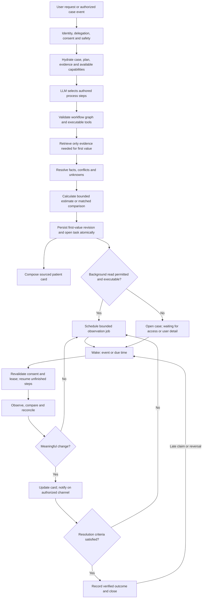
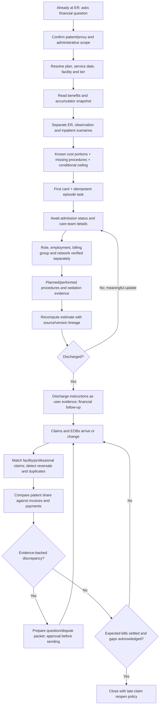
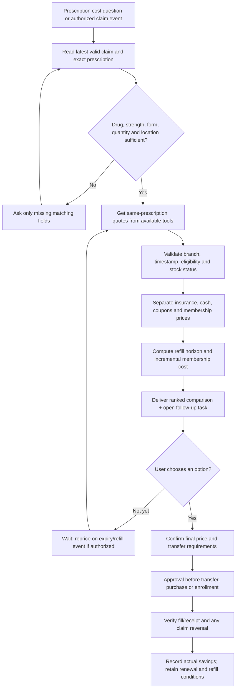
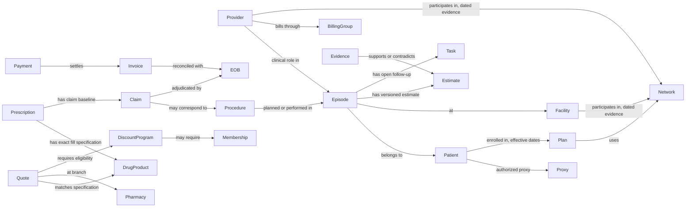

# Graph engineering: evidence → first value → open job → verified outcome

Status: proposed design. No runtime registration or live monitoring is implied.

## 1. One product pattern, two reusable journeys

The LLM identifies the user's goal, selects available evidence tools and explains the result. Deterministic code governs identity, source validity, cost arithmetic, execution authority, idempotency and lifecycle transitions. AFib and tadalafil are examples, not hardcoded routing keywords or new parallel orchestration engines.

This is a **business-state graph**, not a replacement `StateGraph`. Map its steps to the existing LangGraph spine and DB-authored process catalog. Documentation node names are not valid runtime `workflow_graph.steps` until deliberately authored and proven.

## 2. Emergency episode graph

Do not infer current procedures from insurer claims that usually arrive later. Maintain two timelines: care events (user or permitted provider evidence) and financial adjudication events (insurer/EOB/bills). A member report can trigger a question or provisional estimate but cannot become verified coverage truth.

### Required case facts

- `case_id`, patient and proxy references, tenant, episode anchor, plan/network/service-date identity, timezone and consent references.
- `care_state`: reported_emergency / observation / inpatient / discharged / unknown. Store provenance and effective time for each transition.
- Provider facts: role, specialty, rendering NPI, billing NPI/group/TIN if available, facility affiliation, employment status, network/tier, service/date context. Each is separately sourced or explicitly unknown.
- Procedure facts: reported/planned/performed, name/code if verified, setting, professional/facility components, anesthesia/sedation, clinical source reference. No invented CPT code from a diagnosis.
- Evidence references: class, observed_at, effective_at, source hash/version, member/plan match, redaction policy, superseded-by link.
- Estimate revision: known components, conditional components, unknown components, scenario assumptions, calculation inputs, accumulator as-of, conditional eligible ceiling. Null total when not supportable; no invented probability.
- Reconciliation: logical claim IDs, claim versions/reversals, parent-child relationships, EOB share, billed/not-payable/allowed/paid fields, provider invoice and payment/refund records.
- Outcome: resolved questions, corrected charges/refunds, observed versus projected savings, remaining gaps accepted by user, closure and reopening reason.

## 3. Medication graph

### Cost model

Use integer cents; never compare different quantities or strengths as equivalent. Retain both per-fill and per-unit views, but base the recommendation on the prescribed fill. A 90-day alternative requires the user's actual prescription/dispensing eligibility; it is not an automatic multiplication.

For a user-selected horizon with `n` eligible refills:

- `insurance_total = sum(expected_member_share_for_each_fill)` with accumulator and plan-year changes made explicit; if unknown, label a constant-price projection.
- `alternative_total = sum(drug_price + shipping + fees + applicable_tax - eligible_discount) + incremental_membership_cost`.
- `projected_net_savings = insurance_total - alternative_total`.
- For constant per-fill savings `s > 0`, `break_even_fills = ceil(incremental_membership_cost / s)`. If `s <= 0`, membership does not break even on this prescription.
- Existing membership: incremental fee may be zero for the covered horizon. New membership solely for savings: include the full required fee; do not quietly amortize away the cash outlay. Multi-drug allocation is user-approved and counts the membership once.
- One-time signup discount applies once. Renewal prices and quantity/drug exclusions need current evidence. Warehouse pharmacy access, a free coupon at that pharmacy and a members-only prescription program are distinct.
- If accumulator credit is unverified, show immediate savings separately from potential annual insurance tradeoff. Do not promise all cash fills count toward the deductible.

No GoodRx/Costco/Sam's Club-specific connector currently verified in this audit. Use eligible public research/scraping capabilities when actually available; a dedicated provider connector remains planned until implemented and proven. Do not assume membership fees or drug prices from this document.

## 4. Mapping to the current architecture

These are source-level observations at the baseline commit, not production-health claims.

| Responsibility | Existing owner / seam | Required integration or gap |
|---|---|---|
| API boundary and patient client | `project/api/`; Node `src/server/server.mjs`; `src/userapp/` | Keep patient UI behind existing API; Sites demo remains a pitch artifact |
| Planner authority and graph | `src/concierge/langgraphRunner.mjs`: `createBrainstyLangGraph`, `planJourneyNode` | Preserve `input_policy → recall_context → llm_decision → workflow_router → plan_journey → skill_resolver → workflow_executor → observe_evidence → case_state_shadow → compose_response`, including approval branches |
| Dynamic planning contract | `llmOrchestrationDecision.mjs`, `capabilityCatalog.mjs`: `hydrateProcess`, `validateWorkflowGraph` | Author process/step rows; never paste business graph node IDs into planner dispatch |
| Capability metadata | `capabilityCatalogSeed.mjs`, `workflowArchitecture.mjs` | Proposed journey capabilities default `runtime_selectable=0`; registry visibility is not executability |
| Member plan identity | `planIdentity.mjs`; tool `plan_identity_resolver` | Match effective plan, service date and tier; current directory entry alone is insufficient |
| Portal evidence | `openclawOfficialRuntime.mjs`, `portalEvidenceVerifier.mjs` | Bounded current session, allowlisted site, approved read scope, source pointers |
| Structured payer rail | `connectors/aetnaPatientAccess.mjs`, token vault/rail policy | UM employer remains `portal_only`; sandbox proof is not member-production eligibility |
| Public plan/provider evidence | `knowledge/publicRagRetrieval.mjs`, `connectors/planNetDirectory.mjs` | Public source cannot establish a current member accumulator or guarantee coverage |
| Initial process acceptance | `capabilityCatalog.mjs`: `acceptProcessOffer`, `executeAcceptedProcess` | Existing `executeAcceptedProcess` is browser-observation-specific; must extend via governed dispatch, not use it as a generic medication executor |
| Tasks and schedules | `memoryHarness.mjs`: `planTaskFollowups`, private `createTask` / `createScheduledJob` | Current follow-up trigger supports only `claim_submitted`; add episode/first-value events without pretending a claim was submitted |
| Scheduler/heartbeat | `memoryHarness.mjs`: `runUserHeartbeat` | Current heartbeat reports pending actions and explicitly invokes no external adapter. Add real bounded dispatch and proof before claiming monitoring |
| Public research daemon | `researchScheduler.mjs` | Research scheduling is not a ready-made patient claims monitor |
| Durable continuity | `checkpointRunLedger.mjs`, `graphCheckpointer.mjs`, `dispatchIdempotency.mjs`, `workerLeases.mjs`, worker continuations | Reuse run ledger/leases; qualify the actual checkpointer profile before production |
| Storage | `schema.mjs`: `agent_tasks`, `scheduled_jobs`, `processes`, `process_steps`, `workflow_checkpoint_runs`, `agent_outbox` | Store case references in metadata/payload in first slice; any new durable entity needs its owner and cross-process proof |
| Patient answer | `ai2uiBlocks.mjs`, sourced composer and output policy | First value + source date + unknowns + actual job state. No “watching” until active verified scheduler |
| Product memory | `memoryHarness.mjs`, context packets / Graphiti contract | Store pointers and authorized evidence; Graphiti inference cannot override EOB or member truth |

Source links: [runner](../../src/concierge/langgraphRunner.mjs), [catalog](../../src/concierge/capabilityCatalog.mjs), [follow-ups](../../src/concierge/memoryHarness.mjs), [schema](../../src/concierge/schema.mjs), [tool registry](../../src/concierge/workflowArchitecture.mjs).

### Tool binding matrix

| Purpose | Existing catalog key to hydrate | Boundaries |
|---|---|---|
| Benefits/claims observation | `openclaw_authenticated_browser`, `payer_portal_reader` | UM portal-only; availability and approval checked at dispatch |
| Member API reads for eligible plans | `payer_fhir_patient_access_api` | Never substitute production eligibility based on sandbox success |
| Facility/provider lookup | `provider_directory_public_api` | Record specific network and as-of; do not infer employment |
| Plan document lookup | `employer_benefits_doc_rag` | Correct plan version; member-document policy applies |
| EOB/download parsing | `openclaw_document_downloader`, `document_trace_parser` | Existing download approval gate and exact candidate; preserve hash |
| Public medication offers | `public_web_search`, `public_web_scraper_openclaw` | No patient identifiers in queries; honor site restrictions; no CAPTCHA bypass |
| Formulary context | `pbm_formulary_api` | Formulary listing is not a coupon/cash quote; hydrate readiness first |
| Negotiated facility-rate context | `pricing_mrf_query_db` | Not member cost sharing and not a pharmacy price engine |
| Send/submit/schedule | existing write entries | Prepare only unless runtime-selectable and exact action approved |

## 5. Automatic open-job contract

**Open case automatically; activate external monitoring only when permitted.** A real, authorized case event produces an internal task even when the first answer is incomplete. Existing consent should be reused at its actual scope, not repeatedly requested. If background access is absent, the case remains open with an honest pending state.

Proposed event names: `episode_registered`, `first_value_delivered`, `care_detail_received`, `admission_status_changed`, `procedure_updated`, `claim_revision_observed`, `invoice_received`, `payment_received`, `discharge_reported`, `medication_quote_expired`, `fill_confirmed`, `consent_revoked`. These are proposed event semantics, not currently registered runtime events.

Atomic first-value boundary:

1. Persist the case/event evidence and calculation revision.
2. Idempotently create or link the parent `agent_tasks` row using a **tenant/user/case/purpose key**, not only session/job type.
3. Create/link `scheduled_jobs` with appropriate status and capability/consent requirements.
4. Store notification/event-outbox intent within the same durable transaction or recoverable delivery mechanism.
5. Commit, then return the card with `task_id`, actual status and next useful step. A response saying monitoring is active must depend on successful job read-back and dispatcher availability.

Existing dedupe is insufficient for this journey: `createScheduledJob` matches user/session/job type, which can collapse distinct episodes in one session or split one episode across sessions. `createTask` uses user/type/source reference but has no audited new case-purpose uniqueness rule. Add a migration-backed unique case-purpose key and transaction/concurrency proof in the implementation slice. Do not silently change existing jobs.

State separation:

| Business state | Existing persistence representation to adapt | Patient wording |
|---|---|---|
| Open, access ready | task `open`, job `active` only after guards | “Following this episode; next check …” |
| Open, integration unavailable | task `pending_integration`, job `blocked_integration` | “Case saved; automatic checks need connection.” |
| Open, approval missing | task `pending_approval`, job `pending_approval` | “Case saved; approve the specified access to continue.” |
| Awaiting patient detail | task remains open; metadata `waiting_for_user` | “Waiting for admission status; known costs remain available.” |
| Reauthentication required | block affected read job; structured reason | “Please reconnect to refresh claims.” No repeated prompts without new value |
| Revoked / paused / closed | implementation must validate supported terminal mappings | Stop dispatch; preserve audit and user-controlled reactivation |

`createScheduledJob` currently derives status from `requiresIntegration`; do not assume setting an approval string activates a working integration. Proposed expanded lifecycle values in JSON are design semantics, not valid SQL enum assumptions.

### Wake and notification policy

- Prefer event-driven care-detail updates. Insurance claims are not a real-time inpatient clinical feed.
- Proposed default after explicit background-read consent: claims daily while open; after discharge weekly for up to 180 days, with continuation/review instead of silent indefinite polling. This accommodates observed late claims; it is a product policy proposal, not a payer filing deadline.
- UM portal-only: the spine's refresh-token background API policy does not authorize unattended portal scraping. Use permitted session/consent policy for bounded checks; otherwise reconnect/on-demand mode. Mark the portal background policy gap explicitly.
- Pharmacy: recheck on the user's next refill date or quote expiry if authorized; avoid repeated hourly scraping.
- Consent revocation cancels future wakeups and invalidates pending access immediately. Recheck consent inside the lease before every external call.
- Notify on meaningful estimate changes, new member responsibility/denial, inconsistent invoice, expiring actionable offer, or one missing user detail. Stay quiet on identical observations. Batch related claims; honor quiet hours and channel preferences.
- Do not imply external notifications exist: current outbox proposals are not sent messages. Email/WhatsApp is separately gated; prefer the in-app case feed unless a channel is enabled and authorized.
- Close only after adjudication/invoice/payment reconciliation and unresolved gaps are acknowledged. Late revised claims reopen the same case, not a duplicate. No closure merely because discharge or 90 days occurred.

## 6. Knowledge graph versus execution graph

Execution graph: finite, authored and validated process steps. Knowledge graph: sourced relationships available to the planner. Do not allow inferred knowledge edges to grant access or dispatch authority.

Every material relationship needs source reference, observation/effective time and status (reported, verified, contradicted, superseded). A `Provider → clinical role → Episode` edge must never manufacture `employed_by`, `in_network` or `included_in_facility_bill` edges. A quote from a pharmacy does not prove membership pricing.

## 7. Delivery slices and proof

Do not renumber or mark existing phases complete. These are product acceptance slices subordinate to `docs/db/phase-ledger.json`, with Bill Guardian/Phase 93 dependencies where applicable.

| Work item | Scope | Acceptance evidence |
|---|---|---|
| **VD-01: first card + open episode task** | Register authored administrative estimate process; source-backed known/unknown card; transactional first-value/task boundary | Real DB read-back in later process; replay/concurrent events create one task; incomplete data still yields bounded card; invalid member/delegation cannot read |
| VD-02: continuity dispatcher | Resume due job through existing graph/tools, consent/lease checks, retries and meaningful-change notifications | Actual authorized portal read changes case; restart resumes unfinished step; expired auth pauses; revoked consent prevents calls; unchanged content produces no notification |
| VD-03: care team and procedure reconciliation | Distinct roles/employment/billing/network facts; two care/financial timelines; admission/waiver questions | Real authorized evidence pointers change estimate; unknown role facts remain unknown; no clinical instruction or inferred procedure coverage |
| VD-04: prescription comparison | Exact-match quotes, insurance baseline, fees/membership economics, evidence freshness | Real public quote read and independent read-back; wrong strength/quantity rejected; paid membership loses if net cost higher; introductory price applies once |
| VD-05: outcome closure | Bills/payments/refunds/fill confirmations, savings and late-claim reopening | EOB alone cannot mark paid; refund receipt establishes realized savings; reversal removes obsolete claim; late claim reopens same case |

Required negative evaluations: AFib financial question while already receiving care versus request for urgent treatment advice (preserve safety handoff); wrong member/proxy; wrong plan year/tier; stale accumulator; procedure-specific gaps; inaccessible provider portal; unsupported API rail; expired auth/CAPTCHA; duplicate event/concurrent job; cross-tenant pointer; same CPT different specialties; claim reversal; late claim after closure; coupon not valid locally; nonmember versus member quote; unverified fee; cash-claim accumulator uncertainty; attempted transfer/purchase without exact approval.

Current emergency input-policy behavior needs a real evaluation: confirm that safe administrative help can coexist with urgent-care handoff, rather than bypassing the guard or letting it suppress all useful financial information.

Follow `docs/NON_MOCKED_PROOF_RULES.md`: design fixtures are `contract_ready` only; DB/schema checks do not prove live portal access. Any prompt/catalog change needs the required planner evaluations. Real execution needs source-pointer dereference after restart, negative arms, audit/PHI checks and actual dispatcher proof. This documentation-only package does not make those readiness claims.

Success metrics: time to first bounded answer; fraction of numeric claims with valid sources; unresolved cost components surfaced; duplicate jobs prevented; useful versus noisy notifications; estimate revision accuracy; verified recovered/avoided cost; actual prescription savings net of fees; case closure with acknowledged gaps. Never count insurer contractual discounts, projected savings or a saved dashboard as delivered financial savings.
